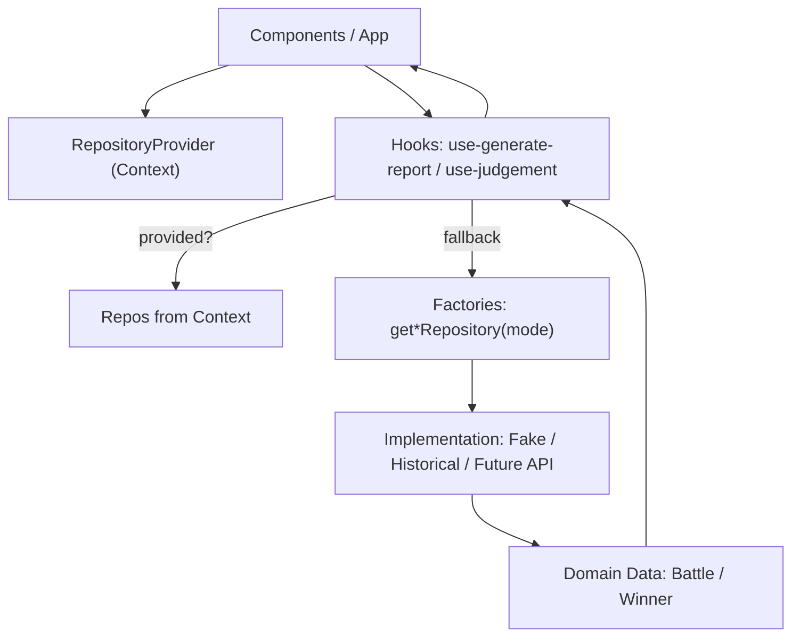
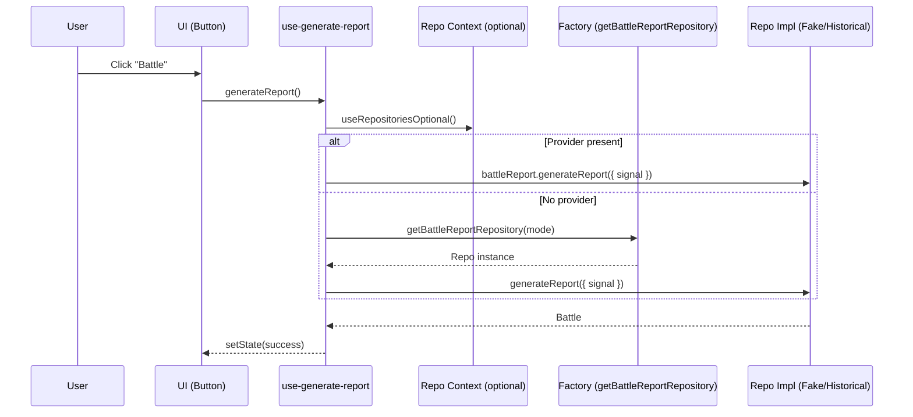
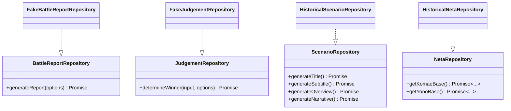

# Yonokomae

[![DeepWiki](https://img.shields.io/badge/DeepWiki-F88%2Fyonokomae-blue.svg?logo=data:image/png;base64,iVBORw0KGgoAAAANSUhEUgAAACwAAAAyCAYAAAAnWDnqAAAAAXNSR0IArs4c6QAAA05JREFUaEPtmUtyEzEQhtWTQyQLHNak2AB7ZnyXZMEjXMGeK/AIi+QuHrMnbChYY7MIh8g01fJoopFb0uhhEqqcbWTp06/uv1saEDv4O3n3dV60RfP947Mm9/SQc0ICFQgzfc4CYZoTPAswgSJCCUJUnAAoRHOAUOcATwbmVLWdGoH//PB8mnKqScAhsD0kYP3j/Yt5LPQe2KvcXmGvRHcDnpxfL2zOYJ1mFwrryWTz0advv1Ut4CJgf5uhDuDj5eUcAUoahrdY/56ebRWeraTjMt/00Sh3UDtjgHtQNHwcRGOC98BJEAEymycmYcWwOprTgcB6VZ5JK5TAJ+fXGLBm3FDAmn6oPPjR4rKCAoJCal2eAiQp2x0vxTPB3ALO2CRkwmDy5WohzBDwSEFKRwPbknEggCPB/imwrycgxX2NzoMCHhPkDwqYMr9tRcP5qNrMZHkVnOjRMWwLCcr8ohBVb1OMjxLwGCvjTikrsBOiA6fNyCrm8V1rP93iVPpwaE+gO0SsWmPiXB+jikdf6SizrT5qKasx5j8ABbHpFTx+vFXp9EnYQmLx02h1QTTrl6eDqxLnGjporxl3NL3agEvXdT0WmEost648sQOYAeJS9Q7bfUVoMGnjo4AZdUMQku50McDcMWcBPvr0SzbTAFDfvJqwLzgxwATnCgnp4wDl6Aa+Ax283gghmj+vj7feE2KBBRMW3FzOpLOADl0Isb5587h/U4gGvkt5v60Z1VLG8BhYjbzRwyQZemwAd6cCR5/XFWLYZRIMpX39AR0tjaGGiGzLVyhse5C9RKC6ai42ppWPKiBagOvaYk8lO7DajerabOZP46Lby5wKjw1HCRx7p9sVMOWGzb/vA1hwiWc6jm3MvQDTogQkiqIhJV0nBQBTU+3okKCFDy9WwferkHjtxib7t3xIUQtHxnIwtx4mpg26/HfwVNVDb4oI9RHmx5WGelRVlrtiw43zboCLaxv46AZeB3IlTkwouebTr1y2NjSpHz68WNFjHvupy3q8TFn3Hos2IAk4Ju5dCo8B3wP7VPr/FGaKiG+T+v+TQqIrOqMTL1VdWV1DdmcbO8KXBz6esmYWYKPwDL5b5FA1a0hwapHiom0r/cKaoqr+27/XcrS5UwSMbQAAAABJRU5ErkJggg==)](https://deepwiki.com/F88/yonokomae)

Yono Komae War

This thought-provoking game explores the outcomes for two countries after 'The World Merger Battle' of the Heisei era (平成の大合併大戦).

```text
Note: This game is full of humorous jokes, but to be clear, it is not a deepfake or a mere fabrication.
```


## Key Features

- Multiple play modes with clear status
    - DEMO: quick demonstration with placeholder data (enabled)
    - HISTORICAL EVIDENCE: WIP mode based on events (enabled)
    - AI MODE: planned, AI-generated scenarios (disabled)
- One-click battle report generation with smooth auto-scroll to latest
- Robust loading and error states
    - Async judgement with simulated latency
    - Shadcn skeleton placeholders on the battle field
- Title screen selection with full keyboard support
    - Navigate: ArrowUp/ArrowDown, J/K, W/S; Confirm: Enter/Space; Home/End
- Global controller shortcuts
    - Battle: B / Enter / Space; Reset: R
- Modern UI stack
    - React + Vite + TypeScript, Tailwind CSS v4, shadcn/ui (New York)
    - Dark mode toggle via class-based theme
- Testing-first setup with Vitest + React Testing Library
- Zero-SSR SPA optimized for client-side rendering
- GitHub Pages deployment with base path configured

## Roadmap / TODO

- Historical Evidence mode
    - Implement data sources and generation rules for historical events
    - Surface provenance/notes in the UI (citations, links, disclaimers)
    - Tests for deterministic generation paths
- AI Mode (later)
    - Evaluate model/provider and on-device vs API trade-offs
    - Add safety guardrails and content filters
    - Provide offline mock for tests and local dev
- Battle UX polish
    - Add progress indicator for async judgement (per-step animation)
    - Improve error surfaces with retry
    - Persist last N battle reports in localStorage with clear button
- Accessibility
    - Ensure keyboard traps are eliminated in dialogs/menus
    - Add aria attributes to interactive elements and list updates
    - High-contrast focus rings consistent with theme
- Internationalization
    - Prepare copy for i18n; externalize strings, English/日本語
    - RTL-friendly layout checks
- Performance
    - Virtualize long battle lists
    - Avoid unnecessary re-renders in `BattleContainer` and children
- Tooling
    - Add pre-commit hooks (lint, typecheck, test) via simple Git hook or Husky
    - Add CI workflow: lint, typecheck, test, build
- Docs
    - Expand developer guide for adding new play modes
    - Document keyboard map and customization

## Tech Stack

- **Framework**: [React](https://react.dev/) v19.1.1
- **Build Tool**: [Vite](https://vitejs.dev/) v7.1.2
- **Language**: [TypeScript](https://www.typescriptlang.org/) v5.8.3
- **UI Framework**: [shadcn/ui](https://ui.shadcn.com/) (New York style)
- **Styling**: [Tailwind CSS](https://tailwindcss.com/) v4.1.12 with [tailwindcss-animate](https://github.com/jamiebuilds/tailwindcss-animate)
- **Icons**: [Lucide React](https://lucide.dev/guide/packages/lucide-react) & [React Icons](https://react-icons.github.io/react-icons/)
- **Testing**: [Vitest](https://vitest.dev/) v3.2.4 & [React Testing Library](https://testing-library.com/docs/react-testing-library/intro/) v16.3.0
- **Linting**: [ESLint](https://eslint.org/) v9.33.0 with TypeScript support
- **Data Generation**: [@faker-js/faker](https://fakerjs.dev/) v10.0.0
- **Deployment**: [GitHub Pages](https://pages.github.com/) via [gh-pages](https://github.com/tschaub/gh-pages)

## Project notes

### Architecture: Repository Pattern

This project adopts the Repository Pattern to decouple data generation/fetching
from UI and domain logic. It allows swapping implementations per play mode, and
enables clean dependency injection and testing.

Key goals:

- Clear contracts for data access (interfaces) decoupled from UI
- Pluggable implementations (fake, historical, future API)
- Mode-based selection with optional latency emulation
- Simple DI for components and hooks; easy unit testing

Directory layout (under `src/yk/repo/`):

- `repositories.ts`: Core interfaces and shared types
    - `BattleReportRepository`, `JudgementRepository`, `ScenarioRepository`, `NetaRepository`
- `repositories.fake.ts`: Default fake implementations
    - Deterministic shapes; uses `@faker-js/faker` for titles/narratives
    - Optional delay with abort support; delay is capped to 10s and disabled in tests
- `repositories.historical.ts`: Historical mode data providers (seeded/static for now)
- `repository-provider.ts`: Async factories to get repositories by `PlayMode`
    - `getBattleReportRepository(mode?)`, `getJudgementRepository(mode?)`
    - Applies sensible default delays per mode (e.g., DEMO vs HISTORICAL)
- `repository-context.ts`: React Context + hooks for DI
- `RepositoryProvider.tsx`: Thin provider that lazily creates repos via factories

Usage in hooks:

- `use-generate-report(mode?)`
    - Resolves a `BattleReportRepository` from provider (if present) or factories
    - Adds a 10s timeout and passes `AbortSignal` down to the repo
- `use-judgement(nameOfJudge, battle, mode)`
    - Resolves a `JudgementRepository` similarly; exposes `idle/loading/success/error`
    - Adds a 10s timeout and passes `AbortSignal`

Latency emulation (fake repos):

- Accepts `delay` as a number or `{ min, max }`
- Negative values clamp to 0
- Values above 10_000ms are capped with a console warning
- Delays are skipped when `NODE_ENV === 'test'`

Testing:

- Unit tests live beside implementations, e.g. `src/yk/repo/repositories.fake.test.ts`
- Tests cover delay capping and basic behavior of fake repositories
- UI tests focus on states (`loading/error/success`) rather than random values

How to add a new implementation (e.g., API-backed):

1. Implement the relevant interface(s) in `src/yk/repo/*` (e.g., `ApiJudgementRepository`)
2. Add a branch in `repository-provider.ts` to return the new repo for certain `PlayMode`
3. If you need configuration, pass it through the provider or Context
4. Add tests for the new repo; prefer deterministic inputs and mock network
5. Optionally document the mode and behavior in this README

Migration note:

- Legacy files under `src/yk/` that re-exported `yk/repo/*` have been removed to
    avoid ambiguity. Consumers should import from `@/yk/repo/...`.

#### Diagrams (Mermaid)

High-level flow of data and DI:



Sequence for generating a battle report:



Interfaces and implementations:



### Styling (Tailwind CSS v4)

- Tailwind v4 is used. The single CSS entry is the project root `index.css`.
    - `src/main.tsx` imports `../index.css`.
    - Tailwind plugin is wired via Vite (`@tailwindcss/vite`), not PostCSS config files.
    - `index.css` registers `@plugin "tailwindcss-animate"` and uses `@theme inline`.
- Dark mode uses the `.dark` class on `document.documentElement` (toggled in `ThemeToggle`).

### shadcn/ui

- Config: see `components.json` (style: `new-york`, aliases for `@/components`, etc.).
- Components live under `src/components/ui`.
- You can add more via shadcn CLI (optional), following the Vite guide.

### Async judgement flow

- `Judge.determineWinner` is async and waits 0..5 seconds before resolving (0 ms in tests).
- Use `useJudgement(nameOfJudge, battle, mode)` to fetch and render results with `loading/error/success` states.
- `mode` must be a `PlayMode` from `@/yk/play-mode`.
- UI component: `JudgeCard` consumes `useJudgement` and handles the states.

### Play mode selection & keyboard shortcuts

- Title screen component allows selecting a play mode using both mouse and keyboard.
- Keyboard on the title screen (global and focused):
    - Navigate: ArrowUp/ArrowDown, J/K, W/S
    - Confirm: Enter or Space
    - Jump to first/last enabled: Home/End
- Controller shortcuts (global):
    - Battle: B, Enter, or Space
    - Reset: R
- Key hints are rendered using the shared `<KeyChip />` component (`src/components/ui/key-chip.tsx`).

### Path aliases

- `@` maps to `src/` (configured in `tsconfig` and `vite.config.ts`).

### Testing notes

- Tests avoid asserting on random values. If you need deterministic behavior for
  `@faker-js/faker`, mock the specific generators within the test case.
  For example, spy on `faker.lorem.words` or `faker.number.int` as needed.
- `faker.number.int` is called three times in `FrontlineJournalist.report`:
  `komae.power`, `yono.power`, and title year.
- For UI tests around the battle field, placeholders and slots expose test IDs
  to make assertions robust:
    - `data-testid="slot-yono"`, `data-testid="slot-komae"`
    - `data-testid="placeholder"`

### SSR

- Server-Side Rendering (SSR) is not used. This app is a client-side rendered SPA.
- Accessing `window`/`document` in components is acceptable.
- Hydration mismatch concerns for random values (e.g., `Math.random()` during render) do not apply in the current setup.

## Release Notes (Changelog) Generation

このプロジェクトでは `@changesets/cli` を利用してリリースノート (CHANGELOG.md) を作成します。

### 使い方

1. 変更内容をまとめるため、コミット後に下記コマンドを実行します。

    ```bash
    npx changeset
    ```

    対話形式で変更内容 (feat, fix など) を記述します。

2. すべての変更がまとまったら、リリースノート (CHANGELOG.md) を生成します。

    ```bash
    npx changeset-changelog
    ```

    または、下記コマンドで既存の CHANGELOG.md を更新できます。

    ```bash
    npx conventional-changelog --infile CHANGELOG.md -r 0 --same-file --preset eslint
    ```

詳細は [changesets documentation](https://github.com/changesets/changesets) を参照してください。
