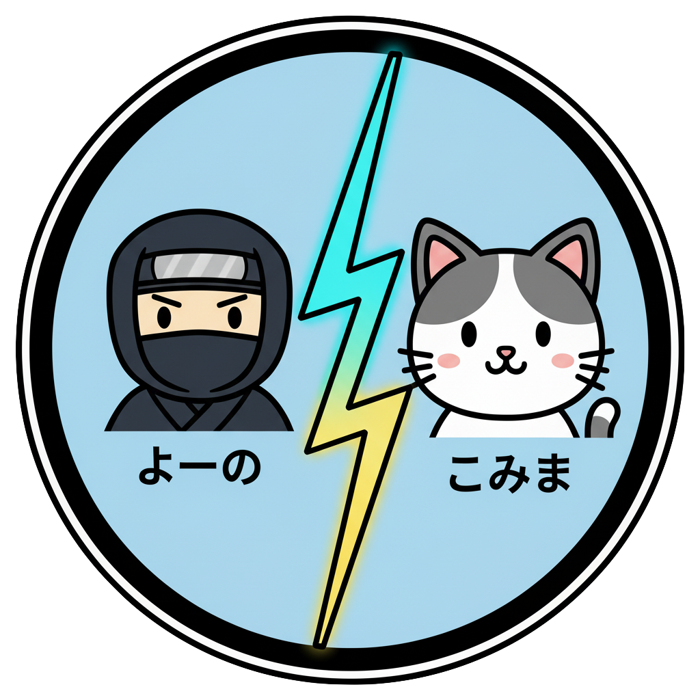

# Yonokomae

[](https://github.com/F88/yonokomae/actions/workflows/ci.yml)
[](https://github.com/F88/yonokomae/actions/workflows/github-code-scanning/codeql)

[](https://deepwiki.com/F88/yonokomae)
[](https://codecov.io/gh/F88/yonokomae)

Yono Komae War

This thought-provoking game explores the outcomes for two countries after 'The World Merger Battle' of the Heisei era (
平成の大合併大戦).

```txt
Note: This game is full of humorous jokes, but to be clear, it is not a deepfake or a mere fabrication.
```


## 「よのこまえ」の活用術10選

1. **🧑‍🎓 小学生の社会学習に** — 歴史の謎を解く探偵ごっこ！「YONOはなぜ合併したの？」「KOMAEの人口はこれからどうなる？」といった、身近な地域の謎をゲームのデータから読み解き、夏休みの自由研究に！
2. **🏛️ 政策立案シミュレーションに** —
   未来の首長が誕生？架空のシナリオ上で「財政力が低下したKOMAEを立て直すには？」「大国に挟まれたYONOが生き残るには？」といった難問に挑戦。未来の市長や政治家を育てるための教材に。
3. **🔮 未来予測のツールとして** — AI vs.
   人間の予測バトル！AIが提示する未来のシミュレーション結果と、プレイヤーの評価を比較。人間の直観や知見が、AIの予測をどれだけ上回れるかを競う、未来のAI開発コンペに。
4. **🏢 企業研修に** — 最強のビジネス戦略家を育成！「限られたリソースで大企業（NPC）とどう付き合うか？」というゲームの問いは、ビジネスの場で直面する課題そのもの。戦略的思考を磨くための研修ツールとして活用。
5. **💼 就職活動の自己分析に** —
   君は「よの」タイプ？「こまえ」タイプ？ゲーム内の選択や評価を通して、自分が「知略と外交」を好むタイプか、「少数精鋭で正面突破」を好むタイプか、客観的に自己分析。面接での強み発見に役立てる。
6. **🏘️ 地域の活性化に** —
   ゲームから「ご当地ヒーロー」が生まれる！「よの」と「こまえ」の戦いの記録をもとに、子どもたちがキャラクターデザインやストーリーを考案。地域の新しいPRキャラクターやイベントの題材として活用。
7. **🎓 大学の講義に** — データサイエンスと歴史学の融合！「AIが提示する未来予測をどう評価するか？」という問いをテーマに、データ分析の講義や歴史社会学のゼミで活用。
8. **🎲 ボードゲーム化に** — 家族でワイワイ、頭脳戦！ゲームのデータをカードやコマにして、アナログなボードゲームに。プレイヤーが「観察者」として勝敗を予想する「よのこまえ大予想会」を開催。
9. **📖 歴史創作の題材に** — 公式は君が創る！ゲーム内で生成された歴史記録を元に、小説や漫画、ショートムービーを創作。プレイヤーの数だけ異なる歴史が生まれる、壮大な「マルチエンディング」コンテンツに。
10. **🗣️ コミュニケーションツールとして** —
    「もしも、あの時、こうだったら？」ゲームのシミュレーション結果を話題に、友人や家族と「もしもYONOが合併しなかったら？」「もしもKOMAEに新幹線が通っていたら？」といった会話で盛り上がる。

## 💌 ファンレター 紹介

| 個人の感想                                                                                                                                                                                                                                                                                                                      | 個人                                  |
| ------------------------------------------------------------------------------------------------------------------------------------------------------------------------------------------------------------------------------------------------------------------------------------------------------------------------------- | ------------------------------------- |
| 🎉 最初、何が面白いのかわからなかったけど、よの軍がAIの予測に反して勝った時、めっちゃ興奮した！僕の『こっちが勝つ！』って予想が当たると、なんか頭がよくなった気がする！                                                                                                                                                         | 🧒 未来の天才予測師(10歳)             |
| 🌅 娘の社会の授業で「YONO市の議員数」を調べてたんですが、このゲームのデータの方が断然面白くて。娘と一緒に「もしもあの時、KOMAEがYONOを吸収合併してたら...」って話し合ってたら、気づいたら朝でした。                                                                                                                             | 👨‍👧 歴史大好きパパ(42歳)               |
| 🍻 毎日会社の飲み会でやってます。AIの評価が部下の評価と重なって怖い...。でも、部長は「よの」タイプ、新人は「こまえ」タイプって例えると、なぜか全員納得してくれてウケる。                                                                                                                                                        | 🍺 ビールを愛するビジネスマン(38歳)   |
| 🧠 このゲーム、全然操作できないのにやめられない！だって、AIの予測と自分の予測が一致した時の「フン、私の見立て通りだな」感が半端ないんです。まるで戦国時代の軍師になった気分（ただのオタクです）。                                                                                                                               | ♟️ 自称・在宅軍師(25歳)               |
| 📊 「第二次世界大合併大戦」って、なんか語呂が良すぎて、最近のプレゼン資料でこっそり使ってます。上司に「それ何？」って聞かれても、「このゲームの世界観です！」って言えば許される（たぶん）。                                                                                                                                     | 🪄 プレゼン資料の魔術師(29歳)         |
| 📊 気づいたら「よのの外交シミュレート」と「KOMAEの人口推移グラフ」をiPadで同時に開いてました。もうこれ、ゲームじゃなくて趣味ですね。最近は、YONOとKOMAEのゆるキャラを勝手に想像して、SNSで投稿してます。                                                                                                                        | 📈 データを愛する妄想家(20歳)         |
| 🔍 SNSで話題になっていたのでプレイしてみたら、思っていたのと全然違いましたね。これ、ゲームというよりは、歴史の裏側を覗き見るインタラクティブな文献って感じです。特に、NPCであるOとUの動きを観察して、その裏にある思惑を考察するのが面白い。自分の考察が結果に反映されると、まるで自分が歴史の黒幕になったような気分になります。 | 📚 文学系ゲーマー(32歳)               |
| ⚡️ カミナリマンが、ピーマンマンに勝ったよ！ママ、見て！                                                                                                                                                                                                                                                                        | 👶 戦いの目撃者(3歳)                  |
| 🌌 Oooh, aaah.                                                                                                                                                                                                                                                                                                                  | 👶 宇宙の真理を悟りし者(0歳)          |
| 🐶 Wouf ! Wouf wouf !                                                                                                                                                                                                                                                                                                           | 🐕 食後の散歩を要求する柴犬(年齢不詳) |

## Architecture & Features

### pnpm Monorepo Structure

- **Application Package**: `@yonokomae/app` (React SPA)
- **Catalog Package**: `@yonokomae/catalog` (列挙 / 定数 / ドメインカタログ)
- **Type Packages**: `@yonokomae/types` (型), `@yonokomae/schema` (Zod スキーマ)
- **Data Packages**:
    - `@yonokomae/data-battle-seeds` - Statistical municipal comparison battles
    - `@yonokomae/data-historical-evidence` - Fictional historical scenarios
    - `@yonokomae/data-news-seeds` - News-style demonstration samples
- **Mock API**: `mock-api/` ローカル開発用スタブサーバ
- **Operations**: `packages/app/src/ops/` - CLI tools for data analysis and export

リポジトリ構造 (簡易図):

```text
yonokomae/
├── packages/
│   ├── app/
│   │   └── src/
│   │       └── ops/         # CLI operational tools
│   ├── catalog/
│   ├── types/
│   └── schema/
├── data/
│   ├── battle-seeds/
│   ├── historical-evidence/
│   └── news-seeds/
├── mock-api/
├── docs/
│   └── data/                # Data-specific documentation
├── e2e/
├── dist/
│   ├── ops/                 # Compiled ops scripts (legacy)
│   └── ops-build/           # New ops build output
└── (no root src/; app code lives under packages/app/src/)
```

> Internal cross-package versions use `workspace:*`. The app depends on all; lower-level packages must not depend on `@yonokomae/app`.

- **Type Safety**: Shared TypeScript definitions (`@yonokomae/types`) and Zod validation schemas (`@yonokomae/schema`)
- **Data Maintenance**: Dedicated workflow for data contributors with comprehensive validation

### Application Features

- One-click battle report generation with smooth auto-scroll to latest
- Interactive user engagement components
    - Usage examples showcase with category-based organization
    - User testimonials with marquee animation effects
    - TSV export functionality for usage data and user voices
- Robust loading and error states
    - Async judgement with simulated latency
    - Shadcn skeleton placeholders on the battle field
    - Loading states with aria-busy for accessibility
    - Custom error classes for battle seed and news reporter repositories
- Modern UI stack
    - React 19 + Vite 7 + TypeScript, Tailwind CSS v4, shadcn/ui (New York)
    - Dark mode toggle via class-based theme
    - Responsive design with breakpoint-aware layouts
    - Font size control with keyboard shortcuts (Alt+Plus/Minus)
- Battle theming and significance levels
    - 8 theme categories (history, culture, community, etc.)
    - 4 significance levels (low, medium, high, legendary)
    - Visual indicators with chips and badges
- Repository-level battle filtering
    - `BattleFilter` component feeds `generateReport({ filter })`
    - Currently supports narrowing by `themeId`
    - Extensible: future fields (`significance`, explicit `id`) planned
- Enhanced battle title presentation
    - `BattleTitleChip` optionally shows a theme icon (`showThemeIcon`)
    - Consistent semantic labeling for accessibility
- Battle seed selector improvements
    - Optional `showIds` prop surfaces internal battle `id` values for debugging / reproducibility
    - Non-intrusive: disabled by default to keep UI concise
- Touch selection accuracy (iOS/WebKit)
    - Adjusted coordinate-based nearest mode correction prevents misaligned selection on iOS Safari
    - Logic activates only on real touch devices; no impact on desktop browsers
- Environment-driven configuration
    - Logging control via `VITE_ENABLE_LOGGING`
    - API base URL configuration
    - News mode configuration options
- Zero-SSR SPA optimized for client-side rendering
- GitHub Pages deployment with base path configured

## Accessibility (Screen Reader)

This game is designed with a Screen Reader-first mindset. Our goal is to
achieve full SR support across core flows. We commit to:

- Stable, concise accessible names for interactive controls
- Proper roles, labels, and descriptions (aria-label / aria-describedby)
- Keyboard-first operation with in-UI hints for shortcuts
- Landmarks and focus management for predictable navigation
- Tests that assert accessibility surfaces (getByRole with name), not visuals
- Respect reduced-motion preferences and avoid information conveyed by visuals only

Status: in progress. We track improvements under the Accessibility section of
the roadmap below and in the developer guides. Contributions to A11y are very
welcome.

### Production vs Test Instrumentation

Some legacy E2E specs depended on a dev/test-only global counter used to tally
mode selections. These were removed to keep production E2E parity: tests now
assert observable UI outcomes rather than internal counters.

## Reduced Motion (prefers-reduced-motion)

We honor the user's reduced motion preference to minimize unnecessary
animations and auto-scrolling. Key points:

- Smooth scrolling falls back to minimal or instant movement when motion is
  reduced. See `src/lib/scroll.ts` and `src/lib/reduced-motion.ts`.
- Marquee and entrance/exit animations shorten or disable under
  `@media (prefers-reduced-motion: reduce)`. See
  `src/components/UserVoicesMarquee.css` and
  `src/components/UsageExamplesMarquee.css`.
- Auto-playing carousels pause/disable autoplay when motion is reduced. See
  `src/components/UserVoicesCarousel.tsx`.

Tip (macOS): System Settings > Accessibility > Display > Reduce motion.

## Documentation

### For Developers

- [Developer guide (EN)](./docs/DEVELOPMENT_EN.md)
- [開発ガイド (JA)](./docs/DEVELOPMENT_JA.md)
- [Testing guide (EN)](./docs/TESTING.md)
- [Contributing guide (en)](CONTRIBUTING_EN.md)
- [Contributing guide (ja)](CONTRIBUTING_JA.md)

### Data & Ops CLI (Analysis)

Operational scripts for exporting and analyzing data live under `packages/app/src/ops/` and are exposed via `pnpm` scripts.

Common commands:

```bash
# Export all battle seeds to JSON (pretty printed)
pnpm run ops:export-battle-seeds-to-json -- out/battles.json

# Analyze battle seeds (loads dist modules directly)
pnpm run ops:analyze-battle-seeds

# Analyze previously exported JSON file
pnpm run ops:analyze-battle-seeds -- out/battles.json

# JSON formatted analysis output (machine-readable)
pnpm run ops:analyze-battle-seeds -- --format=json

# Export usage examples to TSV
pnpm run ops:export-usage-examples-to-tsv -- out/usage-examples.tsv

# Export user voices to TSV
pnpm run ops:export-users-voice-to-tsv -- out/users-voice.tsv

# Show help for any ops command
pnpm run ops:analyze-battle-seeds -- --help
```

The analyzer prints:

- Totals
- Distribution by theme and significance
- Theme × Significance cross-tab matrix
- Power statistics (min / max / avg for komae, yono, combined)
- Top 5 battles by combined power

Use the `--format=json` flag for structured automation/CI pipelines (e.g., trend diffing or regression detection on seed distributions).

### For Data Maintainers

- [Data Maintenance Guide (EN)](./docs/DATA_MAINTENANCE_EN.md)
- [データメンテナンスガイド (JA)](./docs/DATA_MAINTENANCE_JA.md)
- [Battle Seeds Guide](./docs/data/BATTLE_SEEDS_EN.md)
- [Historical Evidence Guide](./docs/data/HISTORICAL_EVIDENCE_SEEDS_EN.md)
- [News Seeds Guide](./docs/data/NEWS_SEEDS_EN.md)

## Deployment (Summary)

Static SPA deployed to GitHub Pages at `/yonokomae/` using scripts:

| Script                    | Purpose                                                           |
| ------------------------- | ----------------------------------------------------------------- |
| `pnpm run build:ghpages`  | Build all packages, build app with base path, generate `404.html` |
| `pnpm run deploy:ghpages` | Build + publish `packages/app/dist` to `gh-pages`                 |

Essential rules: set `VITE_BASE_PATH=/yonokomae/`, publish `packages/app/dist`, duplicate `index.html` → `404.html`.

Full details, troubleshooting matrix, and manual workflow: see [Deployment Guide](./docs/DEPLOYMENT_EN.md).

## Roadmap

### Completed Features

#### Architecture & Infrastructure

- ✅ **pnpm Monorepo**: Clean separation of concerns with independent data packages
- ✅ **Type Safety**: Unified type system with `@yonokomae/types` and `@yonokomae/schema`
- ✅ **Data Package System**: Independent validation and testing for each data domain

#### Game Features

- ✅ Historical Evidence mode with curated event data from `@yonokomae/data-historical-evidence`
- ✅ Battle Seeds mode using real municipal data from `@yonokomae/data-battle-seeds`
- ✅ News mode with sample content from `@yonokomae/data-news-seeds`
- ✅ Multiple play modes: demo (JA/EN/DE), historical-research, yk-now
- ✅ Repository pattern with lazy-loading and code splitting
- ✅ Seed system for deterministic battle generation
- ✅ TSV export functionality for usage data and user voices
- ✅ Battle theming system with 8 categories
- ✅ Significance levels for battle importance (low to legendary)

#### Quality & Testing

- ✅ Comprehensive test coverage (unit, integration, E2E, data validation)
- ✅ E2E tests for key flows (Playwright)
- ✅ Automated data package validation with CI checks
- ✅ Schema validation for all data entries using Zod
- ✅ Vitest with isolated test projects (unit and Storybook)
- ✅ Component testing in real browser environment
- ✅ Central Vitest workspace configuration for project management
- ✅ Accessibility testing with axe-core/playwright
- ✅ Seedable shuffle utilities with regression guards

### In Progress

- Surface provenance/notes in the UI (citations, links, disclaimers)
- Replace placeholder images with licensed assets and show attribution

### Planned

- **Data Maintenance Enhancements**
    - Data package dependency optimization
    - Enhanced validation rules for data quality
    - Automated data migration tools
- **Accessibility improvements**
    - A11y audit (labels, focus management, contrast)
    - Improve keyboard flow after generating a report (focus return/announce)
- **Internationalization**
    - Localize UI strings (EN/JA alignment with docs)
- **Testing enhancements**
    - Optional visual regression for core components
    - Enhanced data package integration testing

## Project notes

See the developer guides linked above for technical implementation details.

| Icon 1                                         | Icon 2                                         | Icon 3                                         |
| ---------------------------------------------- | ---------------------------------------------- | ---------------------------------------------- |
|  |  |  |
