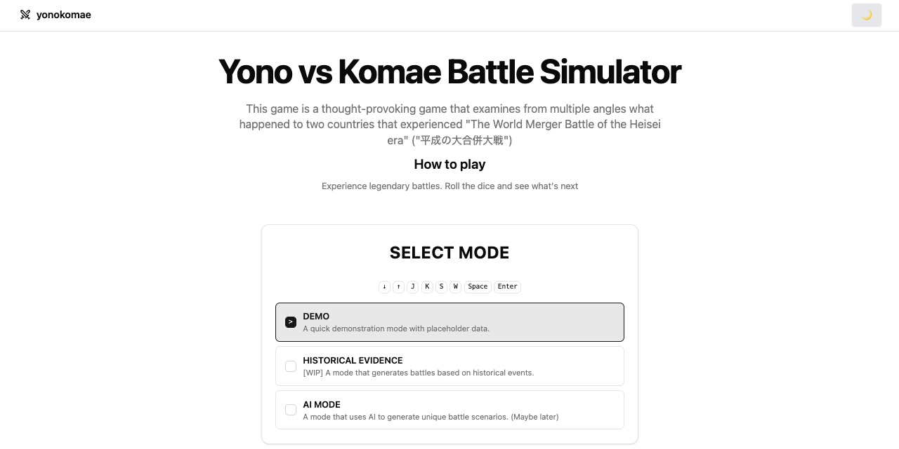

# Yonokomae

[![DeepWiki](https://img.shields.io/badge/DeepWiki-F88%2Fyonokomae-blue.svg?logo=data:image/png;base64,iVBORw0KGgoAAAANSUhEUgAAACwAAAAyCAYAAAAnWDnqAAAAAXNSR0IArs4c6QAAA05JREFUaEPtmUtyEzEQhtWTQyQLHNak2AB7ZnyXZMEjXMGeK/AIi+QuHrMnbChYY7MIh8g01fJoopFb0uhhEqqcbWTp06/uv1saEDv4O3n3dV60RfP947Mm9/SQc0ICFQgzfc4CYZoTPAswgSJCCUJUnAAoRHOAUOcATwbmVLWdGoH//PB8mnKqScAhsD0kYP3j/Yt5LPQe2KvcXmGvRHcDnpxfL2zOYJ1mFwrryWTz0advv1Ut4CJgf5uhDuDj5eUcAUoahrdY/56ebRWeraTjMt/00Sh3UDtjgHtQNHwcRGOC98BJEAEymycmYcWwOprTgcB6VZ5JK5TAJ+fXGLBm3FDAmn6oPPjR4rKCAoJCal2eAiQp2x0vxTPB3ALO2CRkwmDy5WohzBDwSEFKRwPbknEggCPB/imwrycgxX2NzoMCHhPkDwqYMr9tRcP5qNrMZHkVnOjRMWwLCcr8ohBVb1OMjxLwGCvjTikrsBOiA6fNyCrm8V1rP93iVPpwaE+gO0SsWmPiXB+jikdf6SizrT5qKasx5j8ABbHpFTx+vFXp9EnYQmLx02h1QTTrl6eDqxLnGjporxl3NL3agEvXdT0WmEost648sQOYAeJS9Q7bfUVoMGnjo4AZdUMQku50McDcMWcBPvr0SzbTAFDfvJqwLzgxwATnCgnp4wDl6Aa+Ax283gghmj+vj7feE2KBBRMW3FzOpLOADl0Isb5587h/U4gGvkt5v60Z1VLG8BhYjbzRwyQZemwAd6cCR5/XFWLYZRIMpX39AR0tjaGGiGzLVyhse5C9RKC6ai42ppWPKiBagOvaYk8lO7DajerabOZP46Lby5wKjw1HCRx7p9sVMOWGzb/vA1hwiWc6jm3MvQDTogQkiqIhJV0nBQBTU+3okKCFDy9WwferkHjtxib7t3xIUQtHxnIwtx4mpg26/HfwVNVDb4oI9RHmx5WGelRVlrtiw43zboCLaxv46AZeB3IlTkwouebTr1y2NjSpHz68WNFjHvupy3q8TFn3Hos2IAk4Ju5dCo8B3wP7VPr/FGaKiG+T+v+TQqIrOqMTL1VdWV1DdmcbO8KXBz6esmYWYKPwDL5b5FA1a0hwapHiom0r/cKaoqr+27/XcrS5UwSMbQAAAABJRU5ErkJggg==)](https://deepwiki.com/F88/yonokomae)

Yono Komae War

This thought-provoking game explores the outcomes for two countries after 'The World Merger Battle' of the Heisei era (平成の大合併大戦).

```text
Note: This game is full of humorous jokes, but to be clear, it is not a deepfake or a mere fabrication.
```



## Key Features

- Multiple play modes with clear status
    - DEMO: quick demonstration with placeholder data (enabled)
    - HISTORICAL EVIDENCE: deterministic mode based on historical seeds (enabled)
        - Seed-based reproducible generation
        - Tab key to rotate through available seeds
        - Provenance tracking and display
    - AI MODE: planned, AI-generated scenarios (disabled)
- One-click battle report generation with smooth auto-scroll to latest
- Keyboard shortcuts for improved accessibility
    - Enter/Space/B: Generate battle report
    - R: Reset battle state
    - Tab: Rotate historical seed (in Historical Evidence mode)
- Robust loading and error states
    - Async judgement with simulated latency
    - Shadcn skeleton placeholders on the battle field
- Modern UI stack
    - React + Vite + TypeScript, Tailwind CSS v4, shadcn/ui (New York)
    - Dark mode toggle via class-based theme
    - Responsive design with breakpoint-aware layouts
- Zero-SSR SPA optimized for client-side rendering
- GitHub Pages deployment with base path configured

## Documentation

- [Developer guide (EN)](./docs/DEVELOPMENT_EN.md)
- [開発ガイド (JA)](./docs/DEVELOPMENT_JA.md)
- [Testing guide (EN)](./docs/TESTING.md)
- [Contributing guide](./CONTRIBUTING.md)

## Roadmap / TODO

- Historical Evidence mode
    - Expand repositories with curated event data (JSON/seed files) and
      deterministic generation rules
    - Surface provenance/notes in the UI (citations, links, disclaimers)
    - Replace placeholder images with licensed assets and show attribution
    - Add unit tests for deterministic historical paths
- AI Mode (later)
    - Evaluate model/provider and on-device vs API trade-offs
    - Add safety guardrails and content filters
    - Provide offline mock/stub for tests and local dev
- API-backed mode (optional)
    - Wire Api repositories under a dedicated mode (e.g., `api`) using
      `VITE_API_BASE_URL`
    - Provide a mock server and integration tests
    - Add provider branching and a feature flag
- Battle UX polish
    - Add progress indicator for async judgement (per-step animation)
    - Make judgement cancellable with user feedback
    - Respect reduced-motion preferences for scroll/animation
- Accessibility and i18n
    - A11y audit (labels, focus management, contrast)
    - Improve keyboard flow after generating a report (focus return/announce)
    - Localize UI strings (EN/JA alignment with docs)
- Testing
    - Add E2E tests (e.g., Playwright) for key flows
    - Optional visual regression for core components

## Project notes

See the developer guides linked above for technical implementation details.
