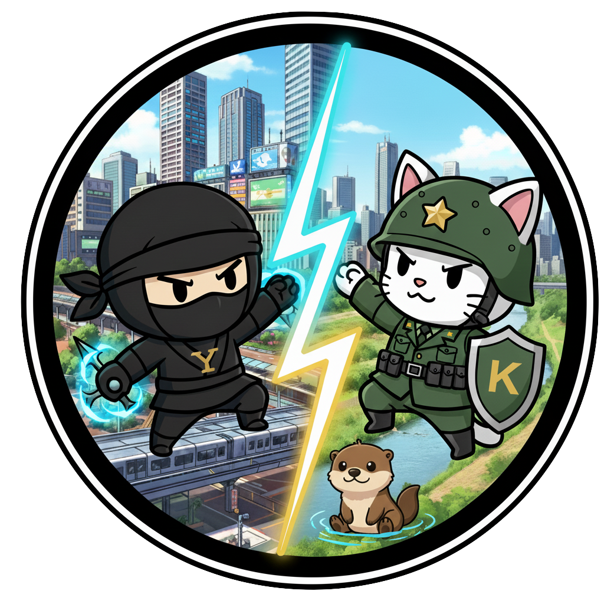

# Yonokomae

[](https://github.com/F88/yonokomae/actions/workflows/ci.yml)
[](https://github.com/F88/yonokomae/actions/workflows/github-code-scanning/codeql)

[![DeepWiki](https://img.shields.io/badge/DeepWiki-F88%2Fyonokomae-blue.svg?logo=data:image/png;base64,iVBORw0KGgoAAAANSUhEUgAAACwAAAAyCAYAAAAnWDnqAAAAAXNSR0IArs4c6QAAA05JREFUaEPtmUtyEzEQhtWTQyQLHNak2AB7ZnyXZMEjXMGeK/AIi+QuHrMnbChYY7MIh8g01fJoopFb0uhhEqqcbWTp06/uv1saEDv4O3n3dV60RfP947Mm9/SQc0ICFQgzfc4CYZoTPAswgSJCCUJUnAAoRHOAUOcATwbmVLWdGoH//PB8mnKqScAhsD0kYP3j/Yt5LPQe2KvcXmGvRHcDnpxfL2zOYJ1mFwrryWTz0advv1Ut4CJgf5uhDuDj5eUcAUoahrdY/56ebRWeraTjMt/00Sh3UDtjgHtQNHwcRGOC98BJEAEymycmYcWwOprTgcB6VZ5JK5TAJ+fXGLBm3FDAmn6oPPjR4rKCAoJCal2eAiQp2x0vxTPB3ALO2CRkwmDy5WohzBDwSEFKRwPbknEggCPB/imwrycgxX2NzoMCHhPkDwqYMr9tRcP5qNrMZHkVnOjRMWwLCcr8ohBVb1OMjxLwGCvjTikrsBOiA6fNyCrm8V1rP93iVPpwaE+gO0SsWmPiXB+jikdf6SizrT5qKasx5j8ABbHpFTx+vFXp9EnYQmLx02h1QTTrl6eDqxLnGjporxl3NL3agEvXdT0WmEost648sQOYAeJS9Q7bfUVoMGnjo4AZdUMQku50McDcMWcBPvr0SzbTAFDfvJqwLzgxwATnCgnp4wDl6Aa+Ax283gghmj+vj7feE2KBBRMW3FzOpLOADl0Isb5587h/U4gGvkt5v60Z1VLG8BhYjbzRwyQZemwAd6cCR5/XFWLYZRIMpX39AR0tjaGGiGzLVyhse5C9RKC6ai42ppWPKiBagOvaYk8lO7DajerabOZP46Lby5wKjw1HCRx7p9sVMOWGzb/vA1hwiWc6jm3MvQDTogQkiqIhJV0nBQBTU+3okKCFDy9WwferkHjtxib7t3xIUQtHxnIwtx4mpg26/HfwVNVDb4oI9RHmx5WGelRVlrtiw43zboCLaxv46AZeB3IlTkwouebTr1y2NjSpHz68WNFjHvupy3q8TFn3Hos2IAk4Ju5dCo8B3wP7VPr/FGaKiG+T+v+TQqIrOqMTL1VdWV1DdmcbO8KXBz6esmYWYKPwDL5b5FA1a0hwapHiom0r/cKaoqr+27/XcrS5UwSMbQAAAABJRU5ErkJggg==)](https://deepwiki.com/F88/yonokomae)

Yono Komae War

This thought-provoking game explores the outcomes for two countries after 'The World Merger Battle' of the Heisei era (
平成の大合併大戦).

```txt
Note: This game is full of humorous jokes, but to be clear, it is not a deepfake or a mere fabrication.
```


## 「よのこまえ」の活用術10選

1. **🧑‍🎓 小学生の社会学習に** — 歴史の謎を解く探偵ごっこ！「YONOはなぜ合併したの？」「KOMAEの人口はこれからどうなる？」といった、身近な地域の謎をゲームのデータから読み解き、夏休みの自由研究に！
2. **🏛️ 政策立案シミュレーションに** —
   未来の首長が誕生？架空のシナリオ上で「財政力が低下したKOMAEを立て直すには？」「大国に挟まれたYONOが生き残るには？」といった難問に挑戦。未来の市長や政治家を育てるための教材に。
3. **🔮 未来予測のツールとして** — AI vs.
   人間の予測バトル！AIが提示する未来のシミュレーション結果と、プレイヤーの評価を比較。人間の直観や知見が、AIの予測をどれだけ上回れるかを競う、未来のAI開発コンペに。
4. **🏢 企業研修に** — 最強のビジネス戦略家を育成！「限られたリソースで大企業（NPC）とどう付き合うか？」というゲームの問いは、ビジネスの場で直面する課題そのもの。戦略的思考を磨くための研修ツールとして活用。
5. **💼 就職活動の自己分析に** —
   君は「よの」タイプ？「こまえ」タイプ？ゲーム内の選択や評価を通して、自分が「知略と外交」を好むタイプか、「少数精鋭で正面突破」を好むタイプか、客観的に自己分析。面接での強み発見に役立てる。
6. **🏘️ 地域の活性化に** —
   ゲームから「ご当地ヒーロー」が生まれる！「よの」と「こまえ」の戦いの記録をもとに、子どもたちがキャラクターデザインやストーリーを考案。地域の新しいPRキャラクターやイベントの題材として活用。
7. **🎓 大学の講義に** — データサイエンスと歴史学の融合！「AIが提示する未来予測をどう評価するか？」という問いをテーマに、データ分析の講義や歴史社会学のゼミで活用。
8. **🎲 ボードゲーム化に** — 家族でワイワイ、頭脳戦！ゲームのデータをカードやコマにして、アナログなボードゲームに。プレイヤーが「観察者」として勝敗を予想する「よのこまえ大予想会」を開催。
9. **📖 歴史創作の題材に** — 公式は君が創る！ゲーム内で生成された歴史記録を元に、小説や漫画、ショートムービーを創作。プレイヤーの数だけ異なる歴史が生まれる、壮大な「マルチエンディング」コンテンツに。
10. **🗣️ コミュニケーションツールとして** —
    「もしも、あの時、こうだったら？」ゲームのシミュレーション結果を話題に、友人や家族と「もしもYONOが合併しなかったら？」「もしもKOMAEに新幹線が通っていたら？」といった会話で盛り上がる。

## 💌 ファンレター 紹介

| 個人の感想                                                                                                                                                                                                                                                                                                                      | 個人                                  |
| ------------------------------------------------------------------------------------------------------------------------------------------------------------------------------------------------------------------------------------------------------------------------------------------------------------------------------- | ------------------------------------- |
| 🎉 最初、何が面白いのかわからなかったけど、よの軍がAIの予測に反して勝った時、めっちゃ興奮した！僕の『こっちが勝つ！』って予想が当たると、なんか頭がよくなった気がする！                                                                                                                                                         | 🧒 未来の天才予測師(10歳)             |
| 🌅 娘の社会の授業で「YONO市の議員数」を調べてたんですが、このゲームのデータの方が断然面白くて。娘と一緒に「もしもあの時、KOMAEがYONOを吸収合併してたら...」って話し合ってたら、気づいたら朝でした。                                                                                                                             | 👨‍👧 歴史大好きパパ(42歳)               |
| 🍻 毎日会社の飲み会でやってます。AIの評価が部下の評価と重なって怖い...。でも、部長は「よの」タイプ、新人は「こまえ」タイプって例えると、なぜか全員納得してくれてウケる。                                                                                                                                                        | 🍺 ビールを愛するビジネスマン(38歳)   |
| 🧠 このゲーム、全然操作できないのにやめられない！だって、AIの予測と自分の予測が一致した時の「フン、私の見立て通りだな」感が半端ないんです。まるで戦国時代の軍師になった気分（ただのオタクです）。                                                                                                                               | ♟️ 自称・在宅軍師(25歳)               |
| 📊 「第二次世界大合併大戦」って、なんか語呂が良すぎて、最近のプレゼン資料でこっそり使ってます。上司に「それ何？」って聞かれても、「このゲームの世界観です！」って言えば許される（たぶん）。                                                                                                                                     | 🪄 プレゼン資料の魔術師(29歳)         |
| 📊 気づいたら「よのの外交シミュレート」と「KOMAEの人口推移グラフ」をiPadで同時に開いてました。もうこれ、ゲームじゃなくて趣味ですね。最近は、YONOとKOMAEのゆるキャラを勝手に想像して、SNSで投稿してます。                                                                                                                        | 📈 データを愛する妄想家(20歳)         |
| 🔍 SNSで話題になっていたのでプレイしてみたら、思っていたのと全然違いましたね。これ、ゲームというよりは、歴史の裏側を覗き見るインタラクティブな文献って感じです。特に、NPCであるOとUの動きを観察して、その裏にある思惑を考察するのが面白い。自分の考察が結果に反映されると、まるで自分が歴史の黒幕になったような気分になります。 | 📚 文学系ゲーマー(32歳)               |
| ⚡️ カミナリマンが、ピーマンマンに勝ったよ！ママ、見て！                                                                                                                                                                                                                                                                        | 👶 戦いの目撃者(3歳)                  |
| 🌌 Oooh, aaah.                                                                                                                                                                                                                                                                                                                  | 👶 宇宙の真理を悟りし者(0歳)          |
| 🐶 Wouf ! Wouf wouf !                                                                                                                                                                                                                                                                                                           | 🐕 食後の散歩を要求する柴犬(年齢不詳) |

## Architecture & Features

### pnpm Monorepo Structure

- **Data Packages**: Independent packages for battle data, historical evidence, and news samples
    - `@yonokomae/data-battle-seeds` - Statistical municipal comparison battles
    - `@yonokomae/data-historical-evidence` - Fictional historical scenarios
    - `@yonokomae/data-news-seeds` - News-style demonstration samples
- **Type Safety**: Shared TypeScript definitions (`@yonokomae/types`) and Zod validation schemas (`@yonokomae/schema`)
- **Data Maintenance**: Dedicated workflow for data contributors with comprehensive validation

### Data model (Battle v2)

Core entity used across the app and data packages:

- id: string (stable unique id)
- themeId: BattleThemeId (see `@yonokomae/catalog` for catalog and ids)
- significance: 'low' | 'medium' | 'high' | 'legendary'
- title: string
- subtitle: string
- narrative: { overview: string; scenario: string }
- komae: Neta { imageUrl, title, subtitle, description, power }
- yono: Neta { imageUrl, title, subtitle, description, power }
- provenance?: Array<{ label, url?, note? }>

References:

- Types: `packages/types/src/battle.ts`
- Schema: `packages/schema/src/battle.ts`
- Theme catalog: `packages/catalog/src/battle-themes.ts`

### Application Features

- One-click battle report generation with smooth auto-scroll to latest
- Interactive user engagement components
    - Usage examples showcase with category-based organization
    - User testimonials with marquee animation effects
    - TSV export functionality for usage data and user voices
- Robust loading and error states
    - Async judgement with simulated latency
    - Shadcn skeleton placeholders on the battle field
- Modern UI stack
    - React 19 + Vite 7 + TypeScript, Tailwind CSS v4, shadcn/ui (New York)
    - Dark mode toggle via class-based theme
    - Responsive design with breakpoint-aware layouts
- Zero-SSR SPA optimized for client-side rendering
- GitHub Pages deployment with base path configured

## Accessibility (Screen Reader)

This game is designed with a Screen Reader-first mindset. Our goal is to
achieve full SR support across core flows. We commit to:

- Stable, concise accessible names for interactive controls
- Proper roles, labels, and descriptions (aria-label / aria-describedby)
- Keyboard-first operation with in-UI hints for shortcuts
- Landmarks and focus management for predictable navigation
- Tests that assert accessibility surfaces (getByRole with name), not visuals
- Respect reduced-motion preferences and avoid information conveyed by visuals only

Status: in progress. We track improvements under the Accessibility section of
the roadmap below and in the developer guides. Contributions to A11y are very
welcome.

## Reduced Motion (prefers-reduced-motion)

We honor the user's reduced motion preference to minimize unnecessary
animations and auto-scrolling. Key points:

- Smooth scrolling falls back to minimal or instant movement when motion is
  reduced. See `src/lib/scroll.ts` and `src/lib/reduced-motion.ts`.
- Marquee and entrance/exit animations shorten or disable under
  `@media (prefers-reduced-motion: reduce)`. See
  `src/components/UserVoicesMarquee.css` and
  `src/components/UsageExamplesMarquee.css`.
- Auto-playing carousels pause/disable autoplay when motion is reduced. See
  `src/components/UserVoicesCarousel.tsx`.

Tip (macOS): System Settings > Accessibility > Display > Reduce motion.

## Documentation

### For Developers

- [Developer guide (EN)](./docs/DEVELOPMENT_EN.md)
- [開発ガイド (JA)](./docs/DEVELOPMENT_JA.md)
- [Testing guide (EN)](./docs/TESTING.md)
- [Contributing guide (en)](CONTRIBUTING_EN.md)
- [Contributing guide (ja)](CONTRIBUTING_JA.md)

### For Data Maintainers

- [Data Maintenance Guide (EN)](./docs/DATA_MAINTENANCE_EN.md)
- [データメンテナンスガイド (JA)](./docs/DATA_MAINTENANCE_JA.md)
- [Battle Seeds Guide](./docs/data/BATTLE_SEEDS_EN.md)
- [Historical Evidence Guide](./docs/data/HISTORICAL_EVIDENCE_SEEDS_EN.md)
- [News Seeds Guide](./docs/data/NEWS_SEEDS_EN.md)

## Roadmap

### Completed Features

#### Architecture & Infrastructure

- ✅ **pnpm Monorepo**: Clean separation of concerns with independent data packages
- ✅ **Type Safety**: Unified type system with `@yonokomae/types` and `@yonokomae/schema`
- ✅ **Data Package System**: Independent validation and testing for each data domain

#### Game Features

- ✅ Historical Evidence mode with curated event data from `@yonokomae/data-historical-evidence`
- ✅ Battle Seeds mode using real municipal data from `@yonokomae/data-battle-seeds`
- ✅ News mode with sample content from `@yonokomae/data-news-seeds`
- ✅ Multiple play modes: demo (JA/EN/DE), historical-research, yk-now
- ✅ Repository pattern with lazy-loading and code splitting
- ✅ Seed system for deterministic battle generation
- ✅ TSV export functionality for usage data and user voices

#### Quality & Testing

- ✅ Comprehensive test coverage (unit, integration, E2E, data validation)
- ✅ E2E tests for key flows (Playwright)
- ✅ Automated data package validation with CI checks
- ✅ Schema validation for all data entries using Zod

### In Progress

- Surface provenance/notes in the UI (citations, links, disclaimers)
- Replace placeholder images with licensed assets and show attribution

### Planned

- **Data Maintenance Enhancements**
    - Data package dependency optimization
    - Enhanced validation rules for data quality
    - Automated data migration tools
- **Accessibility improvements**
    - A11y audit (labels, focus management, contrast)
    - Improve keyboard flow after generating a report (focus return/announce)
- **Internationalization**
    - Localize UI strings (EN/JA alignment with docs)
- **Testing enhancements**
    - Optional visual regression for core components
    - Enhanced data package integration testing

## Project notes

See the developer guides linked above for technical implementation details.

| Icon 1                                         | Icon 2                                         | Icon 3                                         |
| ---------------------------------------------- | ---------------------------------------------- | ---------------------------------------------- |
|  |  |  |
