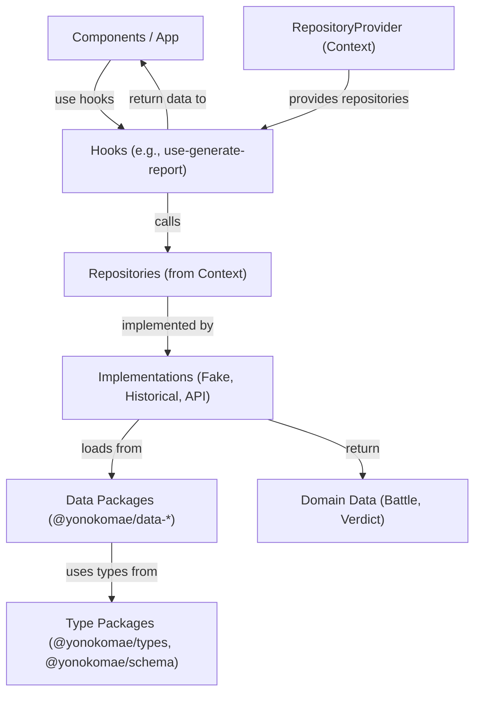
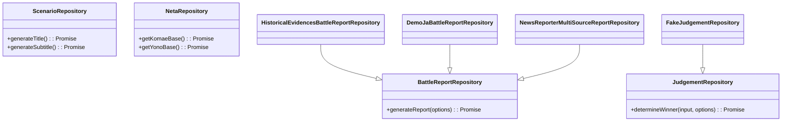

# Development Guide (for Developers)

## Architecture overview

The application follows a modular pnpm monorepo architecture with clear separation of concerns. The core concepts are:

- **Components**: UI elements responsible for rendering and user interaction.
- **Repositories**: Data access layer that abstracts data sources (data packages, APIs).
- **Play Modes**: Configurations that determine which repository implementations are used for a given scenario.
- **RepositoryProvider**: A React context provider that injects the appropriate repository implementations based on the selected Play Mode.
- **Hooks**: Custom React hooks (`use-generate-report`, `use-judgement`) that encapsulate the logic for interacting with repositories.
- **Data Packages**: Independent packages (`data/battle-seeds/`, `data/historical-evidence/`, `data/news-seeds/`) containing game data.
- **Type Packages**: Shared type definitions (`packages/types/`) and validation schemas (`packages/schema/`).

> Note: All source code paths shown below (e.g. `src/yk/...`) are relative to `packages/app/`. The main application lives in `packages/app/src/` – there is no `src/` directory at the repository root.

### Data Flow and Dependency Injection

The `RepositoryProvider` is the central piece for dependency injection. It ensures that components receive the correct repository instances for the active Play Mode.



### Sequence Diagram: Generating a Battle Report


### Repository Interfaces

The core repository contracts are defined in `src/yk/repo/core/repositories.ts`. Repositories consume data from the independent data packages.



## How to Add a New Play Mode or Repository

This section explains how to extend the application with new repositories and Play Modes.

### Adding a New Repository

1. **Create the Repository Implementation:**
   Create a new file under `src/yk/repo/`. For example, `src/yk/repo/example/repositories.example.ts`. Implement one or more of the repository interfaces.

    ```typescript
    // src/yk/repo/example/repositories.example.ts
    import type { BattleReportRepository } from '@/yk/repo/core/repositories';
    import type { Battle } from '@yonokomae/types';
    import { uid } from '@/lib/id';

    export class ExampleBattleReportRepository
        implements BattleReportRepository
    {
        async generateReport(): Promise<Battle> {
            // Load data from data packages
            // const { battles } = await import('@yonokomae/data-battle-seeds');
            return {
                id: uid('battle'),
                title: 'Example Battle',
                // ... other properties
            };
        }
    }
    ```

2. **Wire into Provider Factory:**
   In `src/yk/repo/core/repository-provider.ts`, update the factory functions (`getBattleReportRepository`, `getJudgementRepository`, etc.) to return your new repository implementation for the desired Play Mode.

    ```typescript
    // src/yk/repo/core/repository-provider.ts
    import { ExampleBattleReportRepository } from '@/yk/repo/example/repositories.example';

    export async function getBattleReportRepository(
        mode?: PlayMode,
    ): Promise<BattleReportRepository> {
        if (mode?.id === 'some-mode') {
            return new ExampleBattleReportRepository();
        }
        // ... other modes
    }
    ```

### Adding a New Play Mode

1. **Define the Play Mode:**
   In `src/yk/play-mode.ts`, add a new `PlayMode` object.

    ```typescript
    // src/yk/play-mode.ts
    import type { PlayMode } from '@yonokomae/types';

    export const exampleMode: PlayMode = {
        id: 'example-mode',
        title: 'EXAMPLE MODE',
        description: 'A new mode powered by ExampleRepo',
        enabled: true,
    };
    ```

2. **Implement Repositories:**
   Create the repository implementations for your new mode as described above.

3. **Update Provider Factories:**
   In `src/yk/repo/core/repository-provider.ts`, add a new branch in the factory functions to handle your new `example-mode`. Use dynamic imports to lazy-load the repositories.

    ```typescript
    // src/yk/repo/core/repository-provider.ts
    export async function getBattleReportRepository(
        mode?: PlayMode,
    ): Promise<BattleReportRepository> {
        if (mode?.id === 'example-mode') {
            const { ExampleBattleReportRepository } = await import(
                '@/yk/repo/example/repositories.example'
            );
            return new ExampleBattleReportRepository();
        }
        // ... other modes
    }
    ```

4. **Use the Mode in the UI:**
   Update the UI to allow selecting the new Play Mode, which will then be passed to the `RepositoryProvider`.

## Workspace & Dependency Management

The repository uses a single pnpm workspace (`pnpm-workspace.yaml`) with three glob groups:

```yaml
packages:
    - 'packages/*' # app, catalog, schema, types (library / app code)
    - 'data/*' # seed data packages
    - 'packages/app' # explicit path (redundant but keeps order intent clear)
```

### Internal Package Naming

All internal published-style packages use the `@yonokomae/*` scope:

- Application: `@yonokomae/app` (not published, but scoped for consistency)
- Libraries: `@yonokomae/types`, `@yonokomae/schema`, `@yonokomae/catalog`
- Data: `@yonokomae/data-battle-seeds`, `@yonokomae/data-historical-evidence`, `@yonokomae/data-news-seeds`

Use `"workspace:*"` as the version range for cross-package deps to ensure local linking and avoid accidental mismatches.

### Adding a New Internal Package (Library)

1. Create directory: `packages/<name>/`
2. Add `package.json`:
    ```json
    {
        "name": "@yonokomae/<name>",
        "version": "0.0.0",
        "type": "module",
        "main": "dist/index.js",
        "exports": {
            ".": { "types": "./dist/index.d.ts", "import": "./dist/index.js" }
        },
        "files": ["dist"],
        "scripts": { "build": "tsc -p tsconfig.json" },
        "dependencies": {},
        "devDependencies": {}
    }
    ```
3. Add `tsconfig.json` extending `tsconfig.role.package.json` (or `tsconfig.role.seed.json` for seed-type data) with appropriate `rootDir`/`outDir`.
4. Implement code under `src/` (avoid top-level JS files for tree clarity).
5. Run `pnpm install` (link + ensure lockfile update).
6. Add any new words/types to documentation if public surface (glossary update if needed).

### Adding a New Data Package

Mirror an existing data package for structure symmetry to keep validation and build scripts uniform. Ensure:

- `type` stays `module`.
- Validation tests live in the app repo (do not duplicate heavy test infra inside each data package).
- Consistent tsconfig (copy one of the existing three; keep them aligned).

### Dependency Guidelines

- `dependencies`: Required at runtime by the built artifact or consumer.
- `devDependencies`: Build, test, lint, type tooling only.
- Avoid adding heavy transitive dependencies to seed/data packages; keep them pure data + minimal schema validation.
- Prefer intra-repo reuse over re-implementing small utilities; if shared logic emerges, extract into a new scoped package.
- Do **not** depend on `@yonokomae/app` from any package (app is the leaf / consumer layer).
- Keep dependency graph acyclic: data -> (types/schema), libs -> (types/schema), app -> (all).

### Versioning & Changeset
