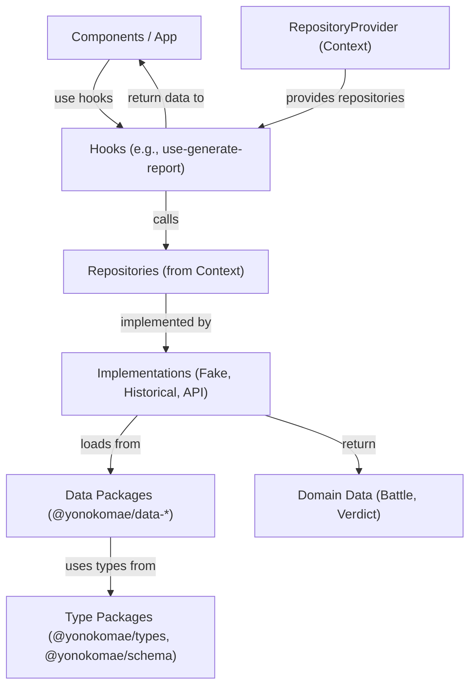
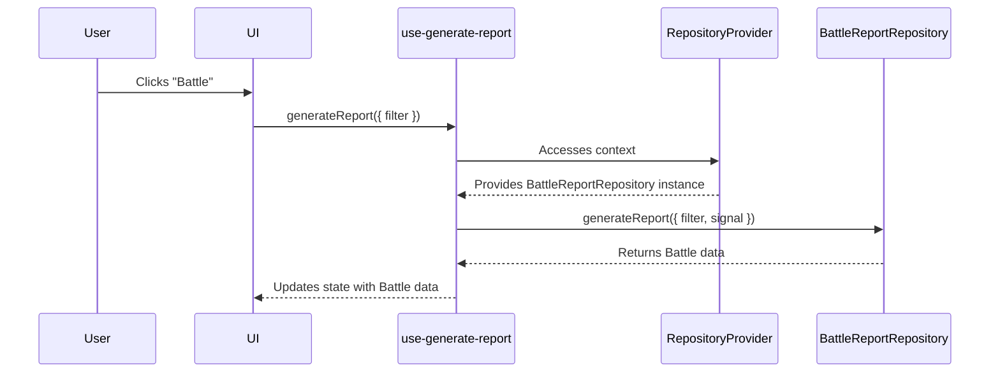

# Development Guide (for Developers)

## Architecture overview

The application follows a modular pnpm monorepo architecture with clear separation of concerns. The core concepts are:

- **Components**: UI elements responsible for rendering and user interaction.
- **Repositories**: Data access layer that abstracts data sources (data packages, APIs).
- **Play Modes**: Configurations that determine which repository implementations are used for a given scenario.
- **RepositoryProvider**: A React context provider that injects the appropriate repository implementations based on the selected Play Mode.
- **Hooks**: Custom React hooks (`use-generate-report`, `use-judgement`) that encapsulate the logic for interacting with repositories.
- **Data Packages**: Independent packages (`data/battle-seeds/`, `data/historical-evidence/`, `data/news-seeds/`) containing game data.
- **Type Packages**: Shared type definitions (`packages/types/`) and validation schemas (`packages/schema/`).

> Note: All source code paths shown below (e.g. `src/yk/...`) are relative to `packages/app/`. The main application lives in `packages/app/src/` – there is no `src/` directory at the repository root.

### Data Flow and Dependency Injection

The `RepositoryProvider` is the central piece for dependency injection. It ensures that components receive the correct repository instances for the active Play Mode.



### Sequence Diagram: Generating a Battle Report



### Repository Interfaces

The core repository contracts are defined in `src/yk/repo/core/repositories.ts`. Repositories consume data from the independent data packages.


### Repository-level Filtering UI (`BattleFilter`)

`BattleFilter` is the developer-facing UI for constraining the battle generation
universe at the repository layer. It supersedes the older `BattleSeedFilter`, which
only filtered a rendered list of seeds and implied UI-only narrowing. All
filtering now flows through `BattleReportRepository.generateReport({ filter })`.

Current capabilities:

- Theme narrowing (injects `filter.battle.themeId`)
- Graceful fallback to full random pool when no filter selected

Recent related enhancements:

- `BattleSeedSelector` exposes an optional `showIds` prop to surface internal battle ids for QA / reproducibility.
- `BattleTitleChip` supports a `showThemeIcon` boolean to prepend a thematic icon; keeps accessible name stable.

Planned / extensible (not yet implemented):

- Significance (`filter.battle.significance`)
- Explicit battle id (`filter.battle.id`) for deterministic reproduction

Deprecation plan for `BattleSeedFilter`:

1. Kept as a thin re-export shim of `BattleFilter` (stories + minimal test) for one minor release.
2. Removed after downstream confirmation; changelog will promote removal to breaking if external consumers exist.

Example (manual generation with theme filter):

```tsx
const { battleReportRepository } = useRepositories();
await battleReportRepository.generateReport({
    filter: { battle: { themeId: 'history' } },
});
```

Example (UI embedding):

```tsx
<BattleFilter
    selectedThemeId={themeId}
    onSelectedThemeIdChange={setThemeId}
    themeIdsFilter={['history', 'technology']}
/>
```

When adding new filter fields:

1. Extend the `GenerateBattleReportParams` type in `repositories.ts`.
2. Implement handling (or explicit ignore docs) across all repository implementations.
3. Add tests verifying narrowing & randomness within the constrained pool.
4. Update this section (EN) then sync `DEVELOPMENT_JA.md`.

### Environment Variables

The file `.env.example` enumerates supported Vite environment variables. Copy it to one of:

- `.env` (all modes)
- `.env.local` (local overrides, gitignored)
- `.env.development`
- `.env.production`

Rules:

- Only `VITE_` prefixed variables are exposed to client code.
- Restart the dev server after adding or removing variables (Vite caches).
- Keep secrets out of any committed file; runtime public vars only.

Supported variables (see inline comments in `.env.example` for defaults and detailed semantics):

| Name                            | Purpose                                                        |
| ------------------------------- | -------------------------------------------------------------- |
| `VITE_API_BASE_URL`             | Backend API base path or absolute URL (`/api` default)         |
| `VITE_LOG_JUDGEMENT_CACHE`      | Verbose cache hit/miss logging for judgement collapsers        |
| `VITE_LOG_JUDGEMENT_TIMING`     | Log timing & duplicate invocation warnings                     |
| `VITE_LOG_HISTORICAL_REPORTS`   | Verbose historical report repository logging                   |
| `VITE_NEWS_REPORT_CACHE_TTL_MS` | Cache TTL (ms) for news reporter HTTP responses                |
| `VITE_BATTLE_RANDOM_WEIGHT_API` | Blend weight (0..1) selecting API vs local data in mixed repos |
| `VITE_BASE_PATH`                | Build-time base path for subdirectory deployments              |

Not environment driven (code-configured): judgement collapsing defaults live in `packages/app/src/yk/repo/core/judgement-config.ts`.

## How to Add a New Play Mode or Repository

This section explains how to extend the application with new repositories and Play Modes.

### Adding a New Repository

1. **Create the Repository Implementation:**
   Create a new file under `src/yk/repo/`. For example, `src/yk/repo/example/repositories.example.ts`. Implement one or more of the repository interfaces.

    ```typescript
    // src/yk/repo/example/repositories.example.ts
    import type { BattleReportRepository } from '@/yk/repo/core/repositories';
    import type { Battle } from '@yonokomae/types';
    import { uid } from '@/lib/id';

    export class ExampleBattleReportRepository
        implements BattleReportRepository
    {
        async generateReport(params?: {
            filter?: { battle?: { themeId?: string } };
            signal?: AbortSignal;
        }): Promise<Battle> {
            // Optional: use params.filter to narrow selection
            // Optional: respect params.signal for abort support
            return {
                id: uid('battle'),
                title: 'Example Battle',
                themeId: params?.filter?.battle?.themeId ?? 'example',
                significance: 'low',
                subtitle: 'Demo',
                narrative: { overview: '', scenario: '' },
                yono: {
                    imageUrl: '',
                    title: 'Yono',
                    subtitle: '',
                    description: '',
                    power: 50,
                },
                komae: {
                    imageUrl: '',
                    title: 'Komae',
                    subtitle: '',
                    description: '',
                    power: 50,
                },
                status: 'success',
            } as Battle;
        }
    }
    ```

2. **Wire into Provider Factory:**
   In `src/yk/repo/core/repository-provider.ts`, update the factory functions (`getBattleReportRepository`, `getJudgementRepository`, etc.) to return your new repository implementation for the desired Play Mode.

    ```typescript
    // src/yk/repo/core/repository-provider.ts
    import { ExampleBattleReportRepository } from '@/yk/repo/example/repositories.example';

    export async function getBattleReportRepository(
        mode?: PlayMode,
    ): Promise<BattleReportRepository> {
        if (mode?.id === 'some-mode') {
            return new ExampleBattleReportRepository();
        }
        // ... other modes
    }
    ```

#### Unified generateReport params

All `BattleReportRepository` implementations now expose a single optional params object:

```ts
interface GenerateBattleReportParams {
    filter?: {
        battle?: {
            id?: string;
            themeId?: string;
            significance?: Battle['significance'];
        };
    };
    signal?: AbortSignal;
}

// Usage examples
await repo.generateReport(); // random battle
await repo.generateReport({ filter: { battle: { themeId: 'history' } } });
const controller = new AbortController();
await repo.generateReport({ signal: controller.signal });
```

Guidelines:

- Always prefer passing a single params object (even if only `signal`).
- Add new filter namespaces under `filter.battle` conservatively; keep flat until clear grouping emerges.
- When adding new filter fields, ensure all implementations either respect them or explicitly document they are ignored.

### Adding a New Play Mode

1. **Define the Play Mode:**
   In `src/yk/play-mode.ts`, add a new `PlayMode` object.

    ```typescript
    // src/yk/play-mode.ts
    import type { PlayMode } from '@yonokomae/types';

    export const exampleMode: PlayMode = {
        id: 'example-mode',
        title: 'EXAMPLE MODE',
        description: 'A new mode powered by ExampleRepo',
        enabled: true,
    };
    ```

2. **Implement Repositories:**
   Create the repository implementations for your new mode as described above.

3. **Update Provider Factories:**
   In `src/yk/repo/core/repository-provider.ts`, add a new branch in the factory functions to handle your new `example-mode`. Use dynamic imports to lazy-load the repositories.

    ```typescript
    // src/yk/repo/core/repository-provider.ts
    export async function getBattleReportRepository(
        mode?: PlayMode,
    ): Promise<BattleReportRepository> {
        if (mode?.id === 'example-mode') {
            const { ExampleBattleReportRepository } = await import(
                '@/yk/repo/example/repositories.example'
            );
            return new ExampleBattleReportRepository();
        }
        // ... other modes
    }
    ```

4. **Use the Mode in the UI:**
   Update the UI to allow selecting the new Play Mode, which will then be passed to the `RepositoryProvider`.

## Workspace & Dependency Management

The repository uses a single pnpm workspace (`pnpm-workspace.yaml`) with three glob groups:

```yaml
packages:
    - 'packages/*' # app, catalog, schema, types (library / app code)
    - 'data/*' # seed data packages
    - 'packages/app' # explicit path (redundant but keeps order intent clear)
```

### Internal Package Naming

All internal published-style packages use the `@yonokomae/*` scope:

- Application: `@yonokomae/app` (not published, but scoped for consistency)
- Libraries: `@yonokomae/types`, `@yonokomae/schema`, `@yonokomae/catalog`
- Data: `@yonokomae/data-battle-seeds`, `@yonokomae/data-historical-evidence`, `@yonokomae/data-news-seeds`

Use `"workspace:*"` as the version range for cross-package deps to ensure local linking and avoid accidental mismatches.

### Adding a New Internal Package (Library)

1. Create directory: `packages/<name>/`
2. Add `package.json`:

    ```json
    {
        "name": "@yonokomae/<name>",
        "version": "0.0.0",
        "type": "module",
        "main": "dist/index.js",
        "exports": {
            ".": { "types": "./dist/index.d.ts", "import": "./dist/index.js" }
        },
        "files": ["dist"],
        "scripts": { "build": "tsc -p tsconfig.json" },
        "dependencies": {},
        "devDependencies": {}
    }
    ```

3. Add `tsconfig.json` extending `tsconfig.role.package.json` (or `tsconfig.role.seed.json` for seed-type data) with appropriate `rootDir`/`outDir`.
4. Implement code under `src/` (avoid top-level JS files for tree clarity).
5. Run `pnpm install` (link + ensure lockfile update).
6. Add any new words/types to documentation if public surface (glossary update if needed).

### Adding a New Data Package

Mirror an existing data package for structure symmetry to keep validation and build scripts uniform. Ensure:

- `type` stays `module`.
- Validation tests live in the app repo (do not duplicate heavy test infra inside each data package).
- Consistent tsconfig (copy one of the existing three; keep them aligned).

### Dependency Guidelines

- `dependencies`: Required at runtime by the built artifact or consumer.
- `devDependencies`: Build, test, lint, type tooling only.
- Avoid adding heavy transitive dependencies to seed/data packages; keep them pure data + minimal schema validation.
- Prefer intra-repo reuse over re-implementing small utilities; if shared logic emerges, extract into a new scoped package.
- Do **not** depend on `@yonokomae/app` from any package (app is the leaf / consumer layer).
- Keep dependency graph acyclic: data -> (types/schema), libs -> (types/schema), app -> (all).

### Versioning & Changeset

A `.changeset/` directory exists for release notes & version bumps. Although packages may not currently be published externally, follow the flow:

- Create a changeset when a package public API or schema meaning changes.
- Use conventional commit prefixes (`feat:`, `fix:`, `docs:`) inside the summary for clarity.
- Mark breaking doc or API changes with `!` in the commit scope if they alter consumer expectations.

### Useful pnpm Filters

```bash
pnpm --filter @yonokomae/app dev            # run app only
pnpm --filter @yonokomae/types test         # test a single lib
pnpm --filter ./data/battle-seeds build     # path-based filter
pnpm -r exec echo {name}                    # list all workspace package names
```

### Build Order

`pnpm -r --sort build` leverages dependency graph ordering:

1. Types / schema / catalog
2. Data packages (if they reference types / schema)
3. App (consumes all)

Project references (`composite: true`) plus `--sort` guarantee declarations are ready before dependents build.

### Common Issues / Diagnostics

| Symptom                            | Likely Cause                              | Fix                                          |
| ---------------------------------- | ----------------------------------------- | -------------------------------------------- |
| Type not found across packages     | Missing `references` or out-of-date build | Run `pnpm -r build` then retry typecheck     |
| Stale generated d.ts               | Editor using old `.types`                 | Delete `node_modules/.types` in app; rebuild |
| Unexpected version bump suggestion | Missing changeset categorization          | Add or adjust a changeset file               |

### When to Split a New Package

Split only when at least one of:

- Code is reused by both app and data packages.
- Build time for app grows due to unrelated module changes.
- Domain concept (e.g., catalog enumerations) stabilizes and merits isolation.

Otherwise keep code colocated to reduce fragmentation.

## Testing

For detailed testing guidelines, see [TESTING.md](TESTING.md).

### End-to-End (E2E) Testing Policy

We use Playwright for E2E testing. Specs are located in the `e2e/` directory.

**Testing Principles:**

- **Focus**: Test user-facing behaviors, not implementation details.
- **Accessibility**: Assert accessible names and roles for critical controls using `getByRole`.
- **Locators**: Prefer role-based locators for resilience. Use `data-testid` sparingly for elements without semantic roles.
- **Determinism**: Avoid arbitrary waits. Use Playwright's web-first assertions and auto-waiting.
- **Performance**: Long-running tests should be tagged with `@performance`.

**Test Commands:**

- `pnpm run e2e` - Run E2E tests (excluding @performance)
- `pnpm run e2e:all` - Run all E2E tests (including @performance)
- `pnpm run e2e:ui` - Interactive UI mode
- `pnpm run e2e:headed` - Run in headed mode (Chromium)

**Data Package Testing:**

- `pnpm test` - Run all tests including data package validation
- `pnpm run test:seeds` - Validate all seed data
- `cd data/{package} && pnpm test` - Test individual data package

### Component Testing

We use Vitest with React Testing Library for component testing:

- `pnpm run test:unit` - Run unit tests
- `pnpm run test:storybook` - Run Storybook tests in browser
- `pnpm run test:coverage` - Generate coverage report

## TypeScript Build Layout

The repository uses a layered tsconfig approach to balance strictness, fast
editor feedback, and consistent declaration output:

- `tsconfig.base.json`: Shared strict defaults (noEmit by default via root
  tsconfig override). No DOM or Node specifics.
- `tsconfig.env.dom.json` / `tsconfig.env.node.json`: Environment-specific
  library targets (DOM vs NodeNext module resolution).
- `tsconfig.role.app.json`: Web app role (React, JSX, declaration-only emit to
  `node_modules/.types/app`). Enables `allowImportingTsExtensions` for Vite /
  shadcn/ui interoperability and additional side-effect safety flags.
- `packages/app/tsconfig.json`: Package entry that sets `baseUrl`, paths and
  points declarationDir at the internal `.types` folder (kept out of `src`).
- `tsconfig.role.package.json`: Generic library/package role (outputs to `dist`).
- `packages/{types,schema,catalog}/tsconfig.json`: Thin wrappers over the
  package role with `rootDir` / `outDir` only.
- `tsconfig.role.seed.json`: DOM env + composite settings for seed data builds.
- `data/*/tsconfig.json`: Three mirrored seed packages (battle-seeds,
  news-seeds, historical-evidence) kept intentionally identical for symmetry.
- `tsconfig.ops.json`: Node environment for operational / CLI scripts emitting
  JS into `dist/ops`.

> Note (2025-09-06): `packages/app/tsconfig.app.json` was removed after confirming no remaining references. Use `tsconfig.role.app.json` (role config) together with `packages/app/tsconfig.json` (package entry) going forward.

Guidelines:

1. Add new roles sparingly—prefer extending an existing role config.
2. Keep environment concerns (DOM vs Node) separate from package roles.
3. Prefer declaration-only emits where runtime bundlers (Vite) handle JS output.
4. Mirror changes across the three seed tsconfig files when adjusting build
   options (or introduce a new shared role file to de-duplicate).
5. Document rationale for any non-standard compiler flags in the nearest
   tsconfig comment block.

Rationale for `allowImportingTsExtensions`: Some UI component templates and
code mod tooling rely on explicit `.ts/.tsx` extensions—enabling this keeps
the developer experience frictionless without relaxing broader strictness.

### Error Classes

Custom error hierarchies improve diagnosability and allow targeted handling:

- `BattleSeedError` (base) -> `BattleSeedNotFoundError`, `BattleSeedValidationError`
- `NewsReporterError` (base) -> `NewsReporterHttpError`, `NewsReporterDataError`

Guidelines:

1. Use the most specific error type possible when throwing.
2. Tests should assert `instanceof` for critical error pathways (see `battle-seed-loader.test.ts`).
3. Messages for user-facing CLI contexts should remain stable to avoid breaking snapshot / expectation tests.

### CLI Operations Scripts

Ops scripts live under `src/ops/` and provide data export & analysis utilities. Each supports `-h` / `--help`:

- `export-battle-seeds-to-json.ts` – Emit all battle seeds as JSON
- `export-users-voice-to-tsv.ts` – Export user voice lines as TSV
- `export-usage-examples-to-tsv.ts` – Export usage examples as TSV
- `analyze-battle-seeds.ts` – Summarize and cross-tabulate battle seed statistics

Usage pattern:

```bash
pnpm run ops:export-battle-seeds-to-json -- out/battles.json
pnpm run ops:export-users-voice-to-tsv -- out/users-voice.tsv
pnpm run ops:export-usage-examples-to-tsv -- out/usage-examples.tsv
# Direct analysis (loads dist modules)
pnpm run ops:analyze-battle-seeds
# Analyze previously exported JSON file
pnpm run ops:analyze-battle-seeds -- out/battles.json
# JSON output for automation
pnpm run ops:analyze-battle-seeds -- --format=json
```

Help example:

```bash
pnpm run ops:export-users-voice-to-tsv -- --help
```

### Battle Seeds Analyzer Details

`analyze-battle-seeds.ts` outputs a concise statistical profile:

- Total battle count
- Distribution by `themeId`
- Distribution by `significance`
- Theme × Significance cross-tab (matrix)
- Power statistics (min / max / avg for `komae`, `yono`, and combined)
- Top 5 battles by combined power (komae.power + yono.power)

Automation tips:

- Use `--format=json` to pipe into diff tools or CI assertions (e.g. detect unintended distribution drift).
- Combine with `jq` for quick extraction: `pnpm run ops:analyze-battle-seeds -- --format=json | jq '.byTheme.development'`.
- Run after data package updates to generate a summary artifact.

Testing:

- See `src/ops/__tests__/export-cli.test.ts` for stdout capture approach.
- Help flags are verified to contain a `Usage:` line.

### Deterministic Shuffle

`shuffleArraySeeded` allows deterministic ordering for reproducible tests. Use when:

1. The test depends on a specific shuffled order.
2. You need to verify stable output across environments.

Avoid injecting seeded randomness into production code paths unless reproducibility is explicitly required.

## Migration Notes

### Breaking Change (2025-09-02): `Winner` -> `Verdict`

The `JudgementRepository.determineWinner` method now returns a structured `Verdict` object instead of a simple `Winner` string.

- **Old:** `Promise<'YONO' | 'KOMAE' | 'DRAW'>`
- **New:** `Promise<Verdict>`

```typescript
type Verdict = {
    winner: 'YONO' | 'KOMAE' | 'DRAW';
    reason: 'bias-hit' | 'power' | 'api' | 'default' | 'near-tie';
    judgeCode?: string;
    /** yono.power - komae.power */
    powerDiff?: number;
    /** sampled random number (0..1) when randomness participates */
    rng?: number;
    /** optional confidence score (0..1) for future model-based judges */
    confidence?: number;
};
```

**Action Required:**

- Update all call sites to access the winner via `verdict.winner`.
- Ensure all `JudgementRepository` implementations return a `Verdict` object.
- Update tests and mocks to match the new return type.

### Infrastructure Change (2025-09-06): Removal of `packages/app/tsconfig.app.json`

The historical transitional config was deleted to reduce duplication and potential drift.

Rationale:

- All editors, CI scripts, and build commands resolve via `tsconfig.role.app.json` + `packages/app/tsconfig.json`.
- Eliminates confusion over which config governs emitted declarations.
- Prevents stale flag divergence (e.g. JSX, moduleResolution).

Action:

- If any local editor workspace still referenced the removed file, retarget it to `packages/app/tsconfig.json`.
- No code changes required; build graph unchanged.

## Current Play Modes

- `demo`: Japanese demo with fixed scenarios.
- `demo-en`: English demo variant.
- `demo-de`: German demo variant.
- `historical-research`: Scenarios based on historical evidence seeds from `@yonokomae/data-historical-evidence`.
- `yk-now`: News-driven mode using data from `@yonokomae/data-news-seeds`.

## UI Components

### Battle Components

- **HistoricalScene**: Main battle display component with loading states and metadata display
    - Supports cropped banner mode with configurable aspect ratios
    - Includes significance chips and theme badges
    - Handles loading skeleton states

- **FontSizeControl**: Responsive font size adjustment control
    - Compact mode for mobile devices
    - Keyboard shortcut support (Alt+Plus/Minus)

### Accessibility Features

- **ReducedMotionModeToggle**: Respects user's motion preferences
- **Keyboard shortcuts**: Controller component supports keyboard navigation (B for Battle, R for Reset)
- **ARIA attributes**: Proper labeling and live regions for screen readers

## Data Maintenance

For data maintainers working with battle data, historical scenarios, or news samples:

- **Main Guide**: See [DATA_MAINTENANCE_EN.md](DATA_MAINTENANCE_EN.md)
- **Battle Data**: See [data/BATTLE_SEEDS_EN.md](data/BATTLE_SEEDS_EN.md)
- **Historical Evidence**: See [data/HISTORICAL_EVIDENCE_SEEDS_EN.md](data/HISTORICAL_EVIDENCE_SEEDS_EN.md)
- **News Seeds**: See [data/NEWS_SEEDS_EN.md](data/NEWS_SEEDS_EN.md)

## Package Structure

```text
yonokomae/
├── packages/
│   ├── app/                      # Main web application (React, hooks, repos)
│   ├── catalog/                  # Domain catalogs / enumerations
│   ├── types/                    # Shared TypeScript types
│   └── schema/                   # Zod validation schemas
├── data/
│   ├── battle-seeds/             # Statistical battle data
│   ├── historical-evidence/      # Historical scenario data
│   └── news-seeds/               # News-style sample data
├── docs/                         # Documentation (English source of truth)
├── e2e/                          # End-to-end tests (Playwright)
├── mock-api/                     # Local mock API server
└── (no root src/ directory – app code is under packages/app/src/)
```
