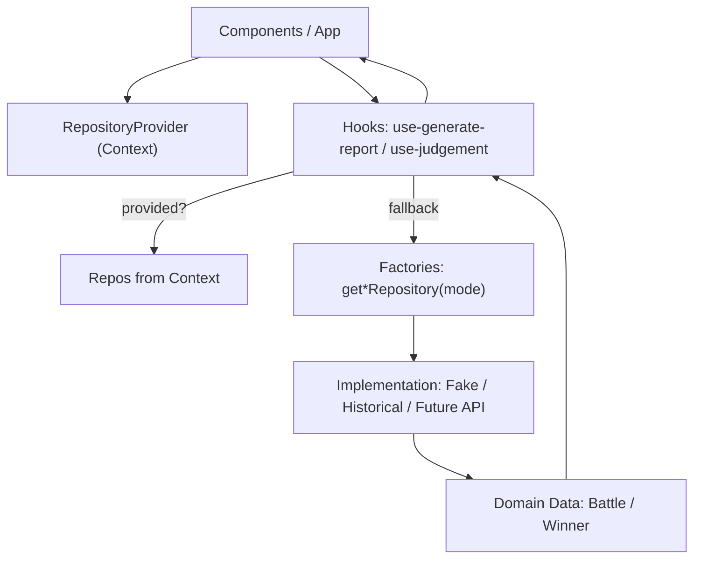
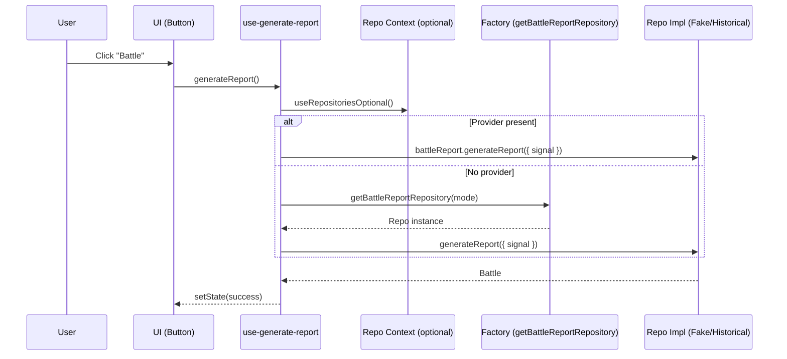
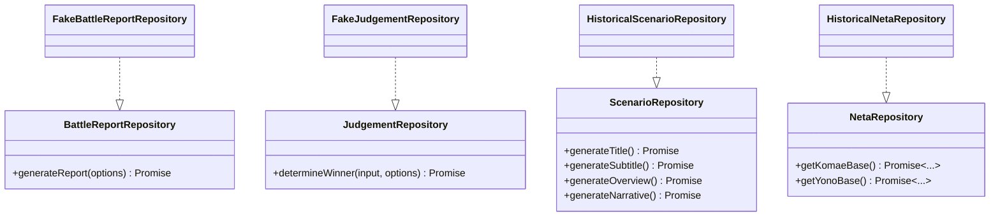

<!--
Dear AIs.
This document should be written in English for AI readability.
Content within code fences may be written in languages other than English.
-->

# Development Guide (for Developers)

This document is intended for developers. It explains how to add a new
Repository implementation and how to add a new Play Mode, using
ExampleRepo and ExampleMode as illustrative samples. All code examples are in
TypeScript with TSDoc comments.

Note: The app is a CSR SPA (no SSR). Dependency injection (DI) is provided via
`RepositoryProvider` (and `RepositoryProviderSuspense` for async init).

## Table of Contents

- Goals and Contracts
- Add a new Repository for an existing Play Mode
- Add a new Play Mode with its Repositories
- Wiring in the Provider Factories
- Using the Provider in the App (and Suspense)
- Testing Helpers and Tips
- Acceptance Checklist
- Suggested Commit Messages

## Goals and Contracts

- Clear repository contracts are defined in `src/yk/repo/repositories.ts`.
- Implementations live under `src/yk/repo/*`.
- Play Modes are defined in `src/yk/play-mode.ts`.
- Provider factories that return concrete repos live in
  `src/yk/repo/repository-provider.ts`.

Core interfaces:

- `BattleReportRepository`
- `JudgementRepository`
- `ScenarioRepository`
- `NetaRepository`

## Add a new Repository for an existing Play Mode

Use this path when you want to add a new repository (ExampleRepo) and consume
it under an existing mode (e.g., `demo`).

1. Create the Repository implementation file

- Location: `src/yk/repo/repositories.example.ts`

Example with TSDoc:

```ts
// src/yk/repo/repositories.example.ts
import type { BattleReportRepository, JudgementRepository, Winner } from '@/yk/repo/repositories';
import type { Battle, Neta } from '@/types/types';
import { uid } from '@/lib/id';

/**
 * ExampleBattleReportRepository
 * @public
 * A sample repository that demonstrates how to produce a Battle entity.
 */
export class ExampleBattleReportRepository implements BattleReportRepository {
  /**
   * Generate or fetch a battle report.
   * @param options Optional signal for cancellation.
   * @returns A fully-populated Battle entity.
   */
  async generateReport(options?: { signal?: AbortSignal }): Promise<Battle> {
    // touch options to satisfy lint until real use is added
    void options?.signal;
    const makeNeta = (title: string): Neta => ({
      title,
      subtitle: 'Example Subtitle',
      description: 'Generated by ExampleRepo',
      imageUrl: 'about:blank',
      power: 42,
    });
    return {
      id: uid('battle'),
      title: 'Example Battle',
      subtitle: 'Showcase',
      overview: 'An example implementation for Battle reports',
      scenario: 'Two sides face off in a demonstration scenario.',
      yono: makeNeta('Yono - Example'),
      komae: makeNeta('Komae - Example'),
      status: 'success',
    };
  }
}

/**
 * ExampleJudgementRepository
 * @public
 * Demonstrates a simple rule for determining the winner.
 */
export class ExampleJudgementRepository implements JudgementRepository {
  /**
   * Decide the winner based on provided input.
   * @param input Includes the current mode and the two combatants.
   * @param options Optional signal for cancellation.
   * @returns The winner id: 'YONO', 'KOMAE', or 'DRAW'.
   */
  async determineWinner(
    input: { mode: { id: string }; yono: Neta; komae: Neta },
    options?: { signal?: AbortSignal },
  ): Promise<Winner> {
    void options?.signal;
    if (input.yono.power === input.komae.power) {
      return 'DRAW';
    }
    return input.yono.power > input.komae.power ? 'YONO' : 'KOMAE';
  }
}
```

1. Wire ExampleRepo into the existing mode

- File: `src/yk/repo/repository-provider.ts`
- Add a branch to return `ExampleBattleReportRepository` and
  `ExampleJudgementRepository` when `mode.id` matches your target mode (e.g.,
  `demo`).

1. (Optional) Tune default delays per mode

- The helper `defaultDelayForMode` can be adjusted to emulate realistic latencies
  for your mode and repository kind.

1. Add tests near the implementation

- File: `src/yk/repo/repositories.example.test.ts`
- Mock timers/random if needed; assert on states and interactions, not random
  values.

## Add a new Play Mode with its Repositories

Use this path when you introduce a brand-new `ExampleMode` and new repositories.

1. Register the Play Mode

- File: `src/yk/play-mode.ts`
- Add an item to `playMode`:

```ts
{
  id: 'example-mode',
  title: 'EXAMPLE MODE',
  description: 'A new mode powered by ExampleRepo',
  enabled: true,
}
```

1. Implement the Repositories

- Location: `src/yk/repo/repositories.example.ts` (same as above) or split as
  needed.

1. Wire the new mode in provider factories

- File: `src/yk/repo/repository-provider.ts`
- Add branches in `getBattleReportRepository` and `getJudgementRepository`:

```ts
if (mode?.id === 'example-mode') {
  const { ExampleBattleReportRepository } = await import('@/yk/repo/repositories.example');
  return new ExampleBattleReportRepository();
}
// ...
if (mode?.id === 'example-mode') {
  const { ExampleJudgementRepository } = await import('@/yk/repo/repositories.example');
  return new ExampleJudgementRepository();
}
```

1. Select the mode in the UI or tests

- Provide `mode={theExampleMode}` to `RepositoryProvider` at the root, or pass
  `mode` to hooks/components that accept explicit DI.

1. Async initialization (if any)

- If your ExampleRepo needs async setup (API warm-up, metadata fetch), use
  `RepositoryProviderSuspense` and wrap with `<Suspense>` in the app shell.

## Wiring in the Provider Factories

- Provider factories live in `src/yk/repo/repository-provider.ts`.
- Add a branch per `mode.id` to instantiate the correct implementation.
- Keep factories lightweight and avoid side effects; prefer async imports.

## Using the Provider in the App (and Suspense)

Basic provider (sync or lazy creation):

```tsx
import React from 'react';
import { RepositoryProvider } from '@/yk/repo/RepositoryProvider';
import { playMode, type PlayMode } from '@/yk/play-mode';

export function Root() {
  const [mode] = React.useState<PlayMode>(playMode[0]);
  return (
    <RepositoryProvider mode={mode}>
      {/* App */}
    </RepositoryProvider>
  );
}
```

Suspense-ready provider (async initialization):

```tsx
import React, { Suspense } from 'react';
import { RepositoryProviderSuspense } from '@/yk/repo/RepositoryProvider';
import type { PlayMode } from '@/yk/play-mode';

export function Root({ mode }: { mode: PlayMode }) {
  return (
    <Suspense fallback={<div>Initializing…</div>}>
      <RepositoryProviderSuspense mode={mode}>
        {/* App */}
      </RepositoryProviderSuspense>
    </Suspense>
  );
}
```

## Testing Helpers and Tips

Testing guidance has moved to TESTING.md. See that document for the test
stack, layout/conventions, helpers (including `renderWithProviders`), examples,
and troubleshooting.

## Acceptance Checklist

- TypeScript compiles with no new errors.
- Unit tests pass locally.
- Provider factory branches implemented for the new mode if applicable.
- README/DEVELOPMENT_EN updated as needed (high-level overview in README; deeper
  steps here).
  See TESTING.md for testing conventions and guidance.

## Suggested Commit Messages

- feat(repo): add ExampleRepo repositories and provider wiring
- docs(dev): add developer guide for ExampleMode and ExampleRepo
- test(repo): add unit tests for ExampleRepo behavior

## Release & Changelog workflow

This project uses Changesets to manage versioning and changelogs.

1. After committing changes, create a changeset to describe them:

  ```bash
  npx changeset
  ```

  Follow the interactive prompts (select type: feat, fix, etc.).

1. When you are ready to generate or update the CHANGELOG.md, run:

  ```bash
  npx changeset-changelog
  ```

  Alternatively, you can update an existing CHANGELOG.md using Conventional Changelog:

  ```bash
  npx conventional-changelog --infile CHANGELOG.md -r 0 --same-file --preset eslint
  ```

References:

- Changesets: [https://github.com/changesets/changesets](https://github.com/changesets/changesets)
- Conventional Changelog: [https://github.com/conventional-changelog](https://github.com/conventional-changelog)

## Architecture diagrams (Mermaid)

High-level flow of data and DI:



Sequence for generating a battle report:



Interfaces and implementations:


