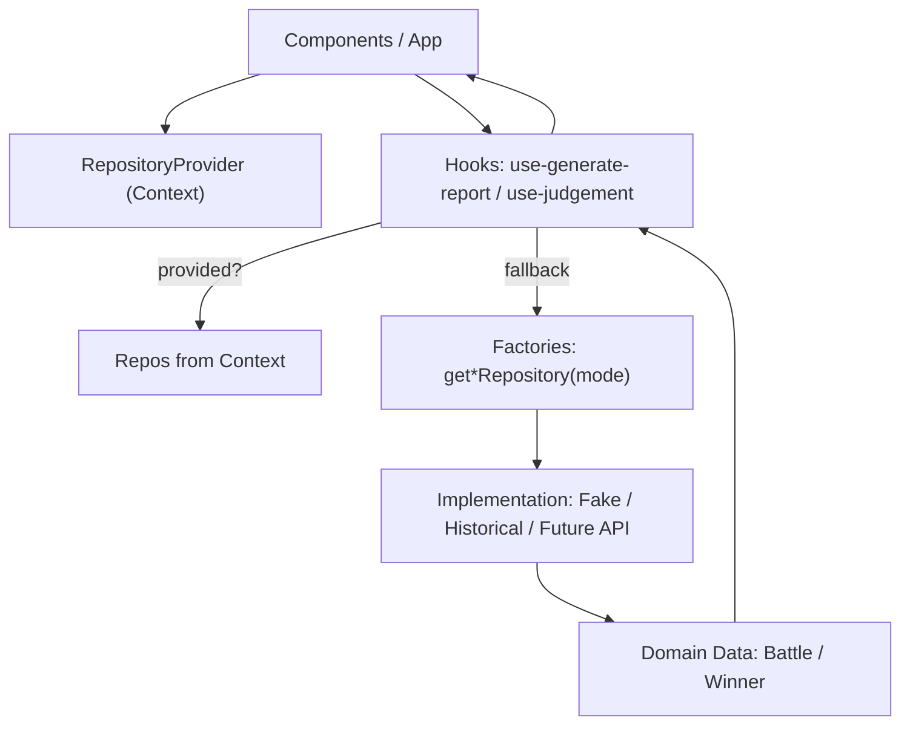
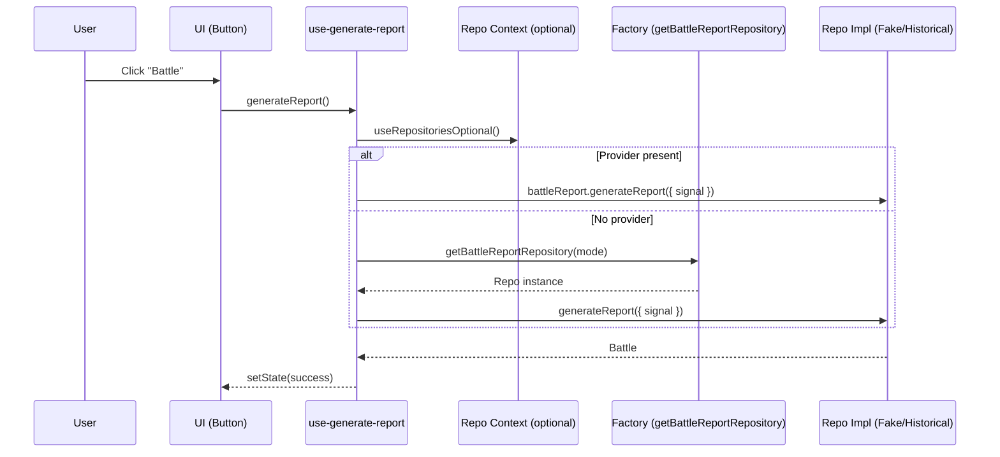
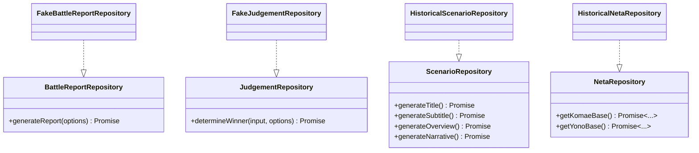

<!--
Dear AIs.
This document should be written in English for AI readability.
Content within code fences may be written in languages other than English.
-->

# Development Guide (for Developers)

## Architecture overview

The architecture is based on a modular design, with a clear separation of concerns between components, repositories, and play modes. The main building blocks are:

- **Components**: The UI components that interact with the user.
- **RepositoryProvider**: A context provider that supplies the appropriate repository implementations to the components.
- **Hooks**: Custom hooks that encapsulate the logic for interacting with the repositories.
- **Repositories**: The data access layer that abstracts the underlying data sources.

## How to add a new Play Mode or Repository

This section is intended for developers. It explains how to add a new
Repository implementation and how to add a new Play Mode, using
ExampleRepo and ExampleMode as illustrative samples. All code examples are in
TypeScript with TSDoc comments.

Note: The app is a CSR SPA (no SSR). Dependency injection (DI) is provided via
`RepositoryProvider` (and `RepositoryProviderSuspense` for async init).

### Goals and Contracts

- Clear repository contracts are defined in `src/yk/repo/repositories.ts`.
- Implementations live under `src/yk/repo/*`.
- Play Modes are defined in `src/yk/play-mode.ts`.
- Provider factories that return concrete repos live in
  `src/yk/repo/repository-provider.ts`.

Core interfaces:

- `BattleReportRepository`
- `JudgementRepository`
- `ScenarioRepository`
- `NetaRepository`

### Architecture diagrams (Mermaid)

High-level flow of data and DI:



Sequence for generating a battle report:



Interfaces and implementations:



### Add a new Repository for an existing Play Mode

Use this path when you want to add a new repository (ExampleRepo) and consume
it under an existing mode (e.g., `demo`).

1. Create the Repository implementation file

- Location: `src/yk/repo/repositories.example.ts`

Example with TSDoc:

```ts
// src/yk/repo/repositories.example.ts
import type {
    BattleReportRepository,
    JudgementRepository,
    Winner,
} from '@/yk/repo/repositories';
import type { Battle, Neta } from '@/types/types';
import { uid } from '@/lib/id';

/**
 * ExampleBattleReportRepository
 * @public
 * A sample repository that demonstrates how to produce a Battle entity.
 */
export class ExampleBattleReportRepository implements BattleReportRepository {
    /**
     * Generate or fetch a battle report.
     * @param options Optional signal for cancellation.
     * @returns A fully-populated Battle entity.
     */
    async generateReport(options?: { signal?: AbortSignal }): Promise<Battle> {
        // touch options to satisfy lint until real use is added
        void options?.signal;
        const makeNeta = (title: string): Neta => ({
            title,
            subtitle: 'Example Subtitle',
            description: 'Generated by ExampleRepo',
            imageUrl: 'about:blank',
            power: 42,
        });
        return {
            id: uid('battle'),
            title: 'Example Battle',
            subtitle: 'Showcase',
            overview: 'An example implementation for Battle reports',
            scenario: 'Two sides face off in a demonstration scenario.',
            yono: makeNeta('Yono - Example'),
            komae: makeNeta('Komae - Example'),
            status: 'success',
        };
    }
}

/**
 * ExampleJudgementRepository
 * @public
 * Demonstrates a simple rule for determining the winner.
 */
export class ExampleJudgementRepository implements JudgementRepository {
    /**
     * Decide the winner based on provided input.
     * @param input Includes the current mode and the two combatants.
     * @param options Optional signal for cancellation.
     * @returns The winner id: 'YONO', 'KOMAE', or 'DRAW'.
     */
    async determineWinner(
        input: { mode: { id: string }; yono: Neta; komae: Neta },
        options?: { signal?: AbortSignal },
    ): Promise<Winner> {
        void options?.signal;
        if (input.yono.power === input.komae.power) {
            return 'DRAW';
        }
        return input.yono.power > input.komae.power ? 'YONO' : 'KOMAE';
    }
}
```

1. Wire ExampleRepo into the existing mode

- File: `src/yk/repo/repository-provider.ts`
- Add a branch to return `ExampleBattleReportRepository` and
  `ExampleJudgementRepository` when `mode.id` matches your target mode (e.g.,
  `demo`).

1. (Optional) Tune default delays per mode

- The helper `defaultDelayForMode` can be adjusted to emulate realistic latencies
  for your mode and repository kind.

1. Add tests near the implementation

- File: `src/yk/repo/repositories.example.test.ts`
- Mock timers/random if needed; assert on states and interactions, not random
  values.

### Add a new Play Mode with its Repositories

Use this path when you introduce a brand-new `ExampleMode` and new repositories.

1. Register the Play Mode

- File: `src/yk/play-mode.ts`
- Add an item to `playMode`:

```ts
{
  id: 'example-mode',
  title: 'EXAMPLE MODE',
  description: 'A new mode powered by ExampleRepo',
  enabled: true,
}
```

1. Implement the Repositories

- Location: `src/yk/repo/repositories.example.ts` (same as above) or split as
  needed.

1. Wire the new mode in provider factories

- File: `src/yk/repo/repository-provider.ts`
- Add branches in `getBattleReportRepository` and `getJudgementRepository`:

```ts
if (mode?.id === 'example-mode') {
    const { ExampleBattleReportRepository } = await import(
        '@/yk/repo/repositories.example'
    );
    return new ExampleBattleReportRepository();
}
// ...
if (mode?.id === 'example-mode') {
    const { ExampleJudgementRepository } = await import(
        '@/yk/repo/repositories.example'
    );
    return new ExampleJudgementRepository();
}
```

1. Select the mode in the UI or tests

- Provide `mode={theExampleMode}` to `RepositoryProvider` at the root, or pass
  `mode` to hooks/components that accept explicit DI.

1. Async initialization (if any)

- If your ExampleRepo needs async setup (API warm-up, metadata fetch), use
  `RepositoryProviderSuspense` and wrap with `<Suspense>` in the app shell.

### Wiring in the Provider Factories

- Provider factories live in `src/yk/repo/repository-provider.ts`.
- Add a branch per `mode.id` to instantiate the correct implementation.
- Keep factories lightweight and avoid side effects; prefer async imports.

### Using the Provider in the App (and Suspense)

Basic provider (sync or lazy creation):

```tsx
import React from 'react';
import { RepositoryProvider } from '@/yk/repo/RepositoryProvider';
import { playMode, type PlayMode } from '@/yk/play-mode';

export function Root() {
    const [mode] = React.useState<PlayMode>(playMode[0]);
    return <RepositoryProvider mode={mode}>{/* App */}</RepositoryProvider>;
}
```

Suspense-ready provider (async initialization):

```tsx
import React, { Suspense } from 'react';
import { RepositoryProviderSuspense } from '@/yk/repo/RepositoryProvider';
import type { PlayMode } from '@/yk/play-mode';

export function Root({ mode }: { mode: PlayMode }) {
    return (
        <Suspense fallback={<div>Initializing…</div>}>
            <RepositoryProviderSuspense mode={mode}>
                {/* App */}
            </RepositoryProviderSuspense>
        </Suspense>
    );
}
```

### Testing Helpers and Tips

See [TESTING.md](./TESTING.md) for testing guidance.

### Acceptance Checklist

- TypeScript compiles with no new errors.
- Unit tests pass locally.
- Provider factory branches implemented for the new mode if applicable.
- README/DEVELOPMENT_EN updated as needed (high-level overview in README; deeper
  steps here).

## Modes and Data Ownership

Note about seeds and modes:

- Random Data (current): demo-style "Random Joke Data" used for prototyping and examples.
  Seeds live under `src/seeds/random-data/**` (TS preferred) and `seeds/random-data/**` (JSON optional).
- Historical Evidence (future): reserved. When introduced, it will use a separate folder and
  stricter provenance rules. Current random-data seeds are not historical data.


- Primary source (Random Data seeds):
    - JSON: `seeds/random-data/scenario/*.json`
    - TS modules: `src/seeds/random-data/scenario/*.ts` exporting
      `export default {...} satisfies HistoricalSeed;`

- Neta base profiles and report config are also seeds:
    - Neta: `seeds/random-data/neta/{komae,yono}.json` (or TS under `src/seeds/random-data/neta/`)
    - Report config: `seeds/random-data/report/config.json` (or TS under `src/seeds/random-data/report/`)

- Repositories:
    - Load from seeds discovered at build-time via `import.meta.glob`. If none are present, use minimal built-in stubs to avoid breaking UI.

Other modes (DEMO, API, etc.) keep their own data/logic within their repositories and are not constrained by the HISTORICAL rules above.

## Historical Seed System

HISTORICAL EVIDENCE supports deterministic seeds to reproduce specific
scenarios or curate demos, with seeds as the single source of truth.

### Architecture Overview

The Historical Seed System consists of:

- **Seed Files**: either JSON under `seeds/random-data/scenario/*.json` or TS modules
  under `src/seeds/random-data/scenario/*.ts` (recommended for type-safety)
- **HistoricalSeedProvider**: React context provider managing seed selection
  state (file path string)
- **Seed Selection Hooks**: Custom hooks to access and rotate seeds
- **Historical Repositories**: Implementations that consume seeds; if none are present, they use minimal built-in stubs (no TS constants)

### Static-only seed loading policy (eager imports)

We intentionally load historical seeds using static, eager imports only.
Dynamic imports are not used for seeds. This avoids mixed static/dynamic
references and the related bundling warnings during build.

- What this means
    - Discovery and loading both use `import.meta.glob(..., { eager: true })` for
  `/src/seeds/random-data/...` (TS) and `/seeds/...` (JSON, if any).
    - `loadSeedByFile(file)` resolves from the eager module map and does not use
      `import()` at runtime.

- Why we chose this
    - Simplicity: synchronous access to module exports, no async boundaries where
      not necessary.
    - Predictable bundling: no Vite/Rollup warnings about "module is dynamically
      imported but also statically imported".
    - Early failure: schema/type errors surface at build/test time.

- Trade-offs
    - Slightly larger initial bundle because all seeds are included. This is
      acceptable for our current seed volume. If volume grows significantly, we
      can revisit code-splitting for seeds.

- Authoring guidance
    - Prefer TypeScript seeds under `src/seeds/random-data/...` for
      type-safety. JSON under `seeds/...` remains supported but not preferred.
    - IDs must be unique across all seeds. CI and runtime enforce uniqueness.
    - No manual registration is required; files are discovered automatically.
    - IDs must be unique across all seeds. CI and runtime enforce uniqueness.
    - No manual registration is required; files are discovered automatically.

### Seed File Structure

Historical seeds use the `HistoricalSeed` shape. Examples:

JSON (`seeds/random-data/scenario/tama-river.json`):

```json
{
    "id": "tama-river-001",
    "title": "Battle of Tama River",
    "subtitle": "A Turning Point in Regional History",
    "overview": "Based on documented events and testimonies.",
    "narrative": "Eyewitness accounts describe a fierce clash near the river banks.",
    "provenance": [
        { "label": "City Archives: Komae", "url": "https://example.org/..." },
        {
            "label": "Historical Society Bulletin 1999",
            "note": "Vol. 12, pp. 45-48"
        }
    ]
}
```

TypeScript (`src/seeds/random-data/scenario/tama-river.ts`):

```ts
import type { HistoricalSeed } from '@/yk/repo/seed-system/seeds';

export default {
    id: 'tama-river-001',
    title: 'Battle of Tama River',
    subtitle: 'A Turning Point in Regional History',
    overview: 'Based on documented events and testimonies.',
    narrative:
        'Eyewitness accounts describe a fierce clash near the river banks.',
    provenance: [
        { label: 'City Archives: Komae', url: 'https://example.org/...' },
        {
            label: 'Historical Society Bulletin 1999',
            note: 'Vol. 12, pp. 45-48',
        },
    ],
} satisfies HistoricalSeed;
```

### Using the Historical Seed System

1. **Adding a new historical seed**:

- Prefer TS modules in `src/seeds/random-data/scenario/` for type-safety
- Or add JSON under `seeds/random-data/scenario/`
- No manual registration is needed: seeds are auto-discovered via `import.meta.glob`

1. **Implementing seed rotation**:

- The Tab key rotates through available seeds in the UI
- Use the `useRotateHistoricalSeed` hook to programmatically rotate seeds:

```tsx
import { useRotateHistoricalSeed } from '@/yk/repo/seed-system/use-rotate-seed';

function MyComponent() {
    const rotateSeed = useRotateHistoricalSeed();

    // Rotate to next seed
    const handleRotate = () => rotateSeed();
}
```

1. **Accessing current seed selection**:

- Use `useHistoricalSeedSelection` to access the current seed:

```tsx
import { useHistoricalSeedSelection } from '@/yk/repo/seed-system/use-seed-selection';

function MyComponent() {
    const seedSelection = useHistoricalSeedSelection();
    const currentSeedFile = seedSelection?.seedFile;
}
```

### Historical Repository Implementation

The `BattleReportRandomDataRepository` demonstrates seed consumption:

```ts
export class BattleReportRandomDataRepository
  implements BattleReportRepository
{
    private readonly seedFile?: string;

    constructor(opts?: { seedFile?: string }) {
        this.seedFile = opts?.seedFile;
    }

    async generateReport(): Promise<Battle> {
  // Prefer a chosen seed; else pick a discovered one. See repositories.random-jokes.ts
        // for the complete behavior and report config application.
        // Returns a fully-formed Battle with provenance.
    }
}
```

## UI Utilities

### Responsive Design with useBreakpoint

The `useBreakpoint` hook provides a reactive way to handle responsive design:

```tsx
import { useBreakpoint } from '@/hooks/use-breakpoint';

function ResponsiveComponent() {
    const isLarge = useBreakpoint('lg'); // true when viewport >= 1024px

    return <div>{isLarge ? <DesktopLayout /> : <MobileLayout />}</div>;
}
```

Breakpoint values are defined in `src/hooks/use-breakpoint.ts` and should match Tailwind configuration.

### Smooth Scrolling with scrollToAnchor

The `scrollToAnchor` utility handles smooth scrolling with sticky header compensation:

```tsx
import { scrollToAnchor } from '@/lib/scroll';

// Basic usage
scrollToAnchor('battle-report-section');

// With options
scrollToAnchor('battle-report-section', {
    stickyHeaderSelector: 'header',
    extraGapSmall: 12, // gap on mobile
    extraGapLarge: 20, // gap on desktop
    largeMinWidth: 1024, // breakpoint for large screens
});
```

This utility is particularly useful for:

- Auto-scrolling to battle reports after generation
- Navigating to specific sections with keyboard shortcuts
- Maintaining proper spacing below sticky headers
