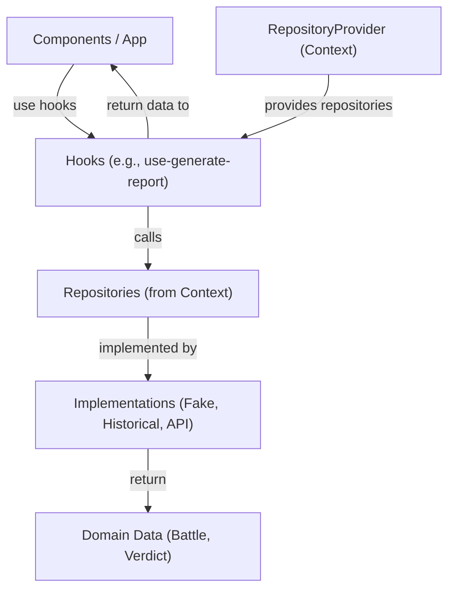
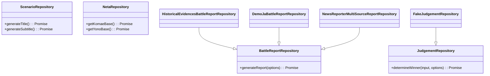

<!--
Dear AIs.
This document should be written in English for AI readability.
Content within code fences may be written in languages other than English.
-->

# Development Guide (for Developers)

## Architecture overview

The application follows a modular architecture with a clear separation of concerns. The core concepts are:

- **Components**: UI elements responsible for rendering and user interaction.
- **Repositories**: Data access layer that abstracts data sources (e.g., local files, APIs).
- **Play Modes**: Configurations that determine which repository implementations are used for a given scenario.
- **RepositoryProvider**: A React context provider that injects the appropriate repository implementations based on the selected Play Mode.
- **Hooks**: Custom React hooks (`use-generate-report`, `use-judgement`) that encapsulate the logic for interacting with repositories.

### Data Flow and Dependency Injection

The `RepositoryProvider` is the central piece for dependency injection. It ensures that components receive the correct repository instances for the active Play Mode.



### Sequence Diagram: Generating a Battle Report


### Repository Interfaces

The core repository contracts are defined in `src/yk/repo/core/repositories.ts`.



## How to Add a New Play Mode or Repository

This section explains how to extend the application with new repositories and Play Modes.

### Adding a New Repository

1.  **Create the Repository Implementation:**
    Create a new file under `src/yk/repo/`. For example, `src/yk/repo/example/repositories.example.ts`. Implement one or more of the repository interfaces.

    ```typescript
    // src/yk/repo/example/repositories.example.ts
    import type { BattleReportRepository } from '@/yk/repo/core/repositories';
    import type { Battle } from '@/types/types';
    import { uid } from '@/lib/id';

    export class ExampleBattleReportRepository
        implements BattleReportRepository
    {
        async generateReport(): Promise<Battle> {
            // Implementation...
            return {
                id: uid('battle'),
                title: 'Example Battle',
                // ... other properties
            };
        }
    }
    ```

2.  **Wire into Provider Factory:**
    In `src/yk/repo/core/repository-provider.ts`, update the factory functions (`getBattleReportRepository`, `getJudgementRepository`, etc.) to return your new repository implementation for the desired Play Mode.

    ```typescript
    // src/yk/repo/core/repository-provider.ts
    import { ExampleBattleReportRepository } from '@/yk/repo/example/repositories.example';

    export async function getBattleReportRepository(
        mode?: PlayMode,
    ): Promise<BattleReportRepository> {
        if (mode?.id === 'some-mode') {
            return new ExampleBattleReportRepository();
        }
        // ... other modes
    }
    ```

### Adding a New Play Mode

1.  **Define the Play Mode:**
    In `src/yk/play-mode.ts`, add a new `PlayMode` object.

    ```typescript
    // src/yk/play-mode.ts
    import type { PlayMode } from '@/types/types';

    export const exampleMode: PlayMode = {
        id: 'example-mode',
        title: 'EXAMPLE MODE',
        description: 'A new mode powered by ExampleRepo',
        enabled: true,
    };
    ```

2.  **Implement Repositories:**
    Create the repository implementations for your new mode as described above.

3.  **Update Provider Factories:**
    In `src/yk/repo/core/repository-provider.ts`, add a new branch in the factory functions to handle your new `example-mode`. Use dynamic imports to lazy-load the repositories.

    ```typescript
    // src/yk/repo/core/repository-provider.ts
    export async function getBattleReportRepository(
        mode?: PlayMode,
    ): Promise<BattleReportRepository> {
        if (mode?.id === 'example-mode') {
            const { ExampleBattleReportRepository } = await import(
                '@/yk/repo/example/repositories.example'
            );
            return new ExampleBattleReportRepository();
        }
        // ... other modes
    }
    ```

4.  **Use the Mode in the UI:**
    Update the UI to allow selecting the new Play Mode, which will then be passed to the `RepositoryProvider`.

## Testing

For detailed testing guidelines, see [TESTING.md](./TESTING.md).

### End-to-End (E2E) Testing

We use Playwright for E2E testing. Specs are located in the `e2e/` directory.

- **Locators**: Prefer role-based locators (`getByRole`) for accessibility. Use `data-testid` for elements without semantic roles.
- **Determinism**: Avoid arbitrary waits. Use Playwright's web-first assertions.
- **Performance**: Long-running tests should be tagged with `@performance`.

## Migration Notes

### Breaking Change (2025-09-02): `Winner` -> `Verdict`

The `JudgementRepository.determineWinner` method now returns a structured `Verdict` object instead of a simple `Winner` string.

- **Old:** `Promise<'YONO' | 'KOMAE' | 'DRAW'>`
- **New:** `Promise<Verdict>`

```typescript
type Verdict = {
    winner: 'YONO' | 'KOMAE' | 'DRAW';
    reason: 'bias-hit' | 'power' | 'api' | 'default' | 'near-tie';
    judgeCode?: string;
    powerDiff?: number;
};
```

**Action Required:**

- Update all call sites to access the winner via `verdict.winner`.
- Ensure all `JudgementRepository` implementations return a `Verdict` object.
- Update tests and mocks to match the new return type.

## Current Play Modes

- `demo`: Japanese demo with fixed scenarios.
- `demo-en`: English demo variant.
- `demo-de`: German demo variant.
- `historical-research`: Scenarios based on historical evidence seeds.
- `yk-now`: News-driven mode using a multi-source repository.
