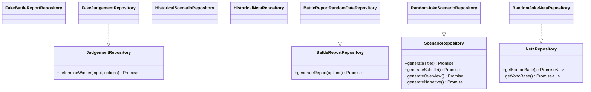

<!--
Dear AIs.
This document should be written in English for AI readability.
Content within code fences may be written in languages other than English.
-->

# Development Guide (for Developers)

## Architecture overview

The architecture is based on a modular design, with a clear separation of concerns between components, repositories, and play modes. The main building blocks are:

- **Components**: The UI components that interact with the user.
- **RepositoryProvider**: A context provider that supplies the appropriate repository implementations to the components.
- **Hooks**: Custom hooks that encapsulate the logic for interacting with the repositories.
- **Repositories**: The data access layer that abstracts the underlying data sources.

## How to add a new Play Mode or Repository

This section is intended for developers. It explains how to add a new
Repository implementation and how to add a new Play Mode, using
ExampleRepo and ExampleMode as illustrative samples. All code examples are in
TypeScript with TSDoc comments.

Note: The app is a CSR SPA (no SSR). Dependency injection (DI) is provided via
`RepositoryProvider` (and `RepositoryProviderSuspense` for async init).

### Goals and Contracts

- Clear repository contracts are defined in `src/yk/repo/core/repositories.ts`.
- Implementations live under `src/yk/repo/*`.
- Play Modes are defined in `src/yk/play-mode.ts`.
- Provider factories that return concrete repos live in
  `src/yk/repo/core/repository-provider.ts`.

Core interfaces:

- `BattleReportRepository`
- `JudgementRepository`
- `ScenarioRepository`
- `NetaRepository`

### Architecture diagrams (Mermaid)

High-level flow of data and DI:


Sequence for generating a battle report:


Interfaces and implementations:



### Add a new Repository for an existing Play Mode

Use this path when you want to add a new repository (ExampleRepo) and consume
it under an existing mode (e.g., `demo`).

Note: Repository implementations are organized by type under `src/yk/repo/`:

- `api/` - REST API client implementations
- `core/` - Repository interfaces and provider logic
- `demo/` - Demo/fixed data repositories
- `historical-evidences/` - Curated historical data repositories
- `mock/` - Test/fake repositories (FakeJudgementRepository only)
- `random-jokes/` - Seed-based random data repositories (default)
- `seed-system/` - Historical seed management system

1. Create the Repository implementation file

- Location: `src/yk/repo/example/repositories.example.ts`

Example with TSDoc:

```ts
// src/yk/repo/example/repositories.example.ts
import type {
    BattleReportRepository,
    JudgementRepository,
    Winner,
} from '@/yk/repo/core/repositories';
import type { Battle, Neta } from '@/types/types';
import { uid } from '@/lib/id';

/**
 * ExampleBattleReportRepository
 * @public
 * A sample repository that demonstrates how to produce a Battle entity.
 */
export class ExampleBattleReportRepository implements BattleReportRepository {
    /**
     * Generate or fetch a battle report.
     * @param options Optional signal for cancellation.
     * @returns A fully-populated Battle entity.
     */
    async generateReport(options?: { signal?: AbortSignal }): Promise<Battle> {
        // touch options to satisfy lint until real use is added
        void options?.signal;
        const makeNeta = (title: string): Neta => ({
            title,
            subtitle: 'Example Subtitle',
            description: 'Generated by ExampleRepo',
            imageUrl: 'about:blank',
            power: 42,
        });
        return {
            id: uid('battle'),
            title: 'Example Battle',
            subtitle: 'Showcase',
            overview: 'An example implementation for Battle reports',
            scenario: 'Two sides face off in a demonstration scenario.',
            yono: makeNeta('Yono - Example'),
            komae: makeNeta('Komae - Example'),
            status: 'success',
        };
    }
}

/**
 * ExampleJudgementRepository
 * @public
 * Demonstrates a simple rule for determining the winner.
 */
export class ExampleJudgementRepository implements JudgementRepository {
    /**
     * Decide the winner based on provided input.
     * @param input Includes the current mode and the two combatants.
     * @param options Optional signal for cancellation.
     * @returns The winner id: 'YONO', 'KOMAE', or 'DRAW'.
     */
    async determineWinner(
        input: { mode: { id: string }; yono: Neta; komae: Neta },
        options?: { signal?: AbortSignal },
    ): Promise<Winner> {
        void options?.signal;
        if (input.yono.power === input.komae.power) {
            return 'DRAW';
        }
        return input.yono.power > input.komae.power ? 'YONO' : 'KOMAE';
    }
}
```

1. Wire ExampleRepo into the existing mode

- File: `src/yk/repo/core/repository-provider.ts`
- Add a branch to return `ExampleBattleReportRepository` and
  `ExampleJudgementRepository` when `mode.id` matches your target mode (e.g.,
  `demo`).

1. (Optional) Tune default delays per mode

- The helper `defaultDelayForMode` can be adjusted to emulate realistic latencies
  for your mode and repository kind.

1. Add tests near the implementation

- File: `src/yk/repo/example/repositories.example.test.ts`
- Mock timers/random if needed; assert on states and interactions, not random
  values.

### Add a new Play Mode with its Repositories

Use this path when you introduce a brand-new `ExampleMode` and new repositories.

1. Register the Play Mode

- File: `src/yk/play-mode.ts`
- Add an item to `playMode`:

```
// @ts-nocheck
// Adjust the type to your project definition
type PlayMode = { id: string; title: string; description: string; enabled: boolean };
export const exampleMode: PlayMode = {
  id: 'example-mode',
  title: 'EXAMPLE MODE',
  description: 'A new mode powered by ExampleRepo',
  enabled: true,
};
```

1. Implement the Repositories

- Location: `src/yk/repo/example/repositories.example.ts` (same as above) or split as
  needed.

1. Wire the new mode in provider factories

- File: `src/yk/repo/core/repository-provider.ts`
- Add branches in `getBattleReportRepository` and `getJudgementRepository`:

```ts
if (mode?.id === 'example-mode') {
    const { ExampleBattleReportRepository } = await import(
        '@/yk/repo/example/repositories.example'
    );
    return new ExampleBattleReportRepository();
}
// ...
if (mode?.id === 'example-mode') {
    const { ExampleJudgementRepository } = await import(
        '@/yk/repo/example/repositories.example'
    );
    return new ExampleJudgementRepository();
}
```

1. Select the mode in the UI or tests

- Provide `mode={theExampleMode}` to `RepositoryProvider` at the root, or pass
  `mode` to hooks/components that accept explicit DI.

1. Async initialization (if any)

- If your ExampleRepo needs async setup (API warm-up, metadata fetch), use
  `RepositoryProviderSuspense` and wrap with `<Suspense>` in the app shell.

### Wiring in the Provider Factories

- Provider factories live in `src/yk/repo/core/repository-provider.ts`.
- Add a branch per `mode.id` to instantiate the correct implementation.
- Keep factories lightweight and avoid side effects; prefer async imports.

### Using the Provider in the App (and Suspense)

Basic provider (sync or lazy creation):

```tsx
import React from 'react';
import { RepositoryProvider } from '@/yk/repo/core/RepositoryProvider';
import { playMode, type PlayMode } from '@/yk/play-mode';

export function Root() {
    const [mode] = React.useState<PlayMode>(playMode[0]);
    return <RepositoryProvider mode={mode}>{/* App */}</RepositoryProvider>;
}
```

Suspense-ready provider (async initialization):

```tsx
import React, { Suspense } from 'react';
import { RepositoryProviderSuspense } from '@/yk/repo/core/RepositoryProvider';
import type { PlayMode } from '@/yk/play-mode';

export function Root({ mode }: { mode: PlayMode }) {
    return (
        <Suspense fallback={<div>Initializing…</div>}>
            <RepositoryProviderSuspense mode={mode}>
                {/* App */}
            </RepositoryProviderSuspense>
        </Suspense>
    );
}
```

### Testing Helpers and Tips

See [TESTING.md](./TESTING.md) for testing guidance.

## End-to-End (E2E) testing policy

We use Playwright for E2E coverage of core user flows and accessibility
surfaces. Keep tests fast, deterministic, and focused on behavior users
experience.

Principles

- Scope: place specs under `e2e/` and keep them task-oriented.
- Locators: prefer `getByRole(..., { name })`; use `data-testid` only for
  non-semantic containers (e.g., `battle`, `slot-yono`, `slot-komae`). Avoid
  brittle CSS/XPath.
- Determinism: avoid arbitrary waits; rely on `expect(...).toHave*` assertions.
  Honor `prefers-reduced-motion`; emulate reduced motion in tests when helpful.
- Performance tests: long-running or high-count flows should be marked as slow
  and tagged `@performance` so they can be filtered separately.
- Accessibility: assert accessible names and roles for critical controls.

Annotations and tags

- Tags are grep-able in Playwright (e.g., `@performance`, `@a11y`, `@smoke`).
- Add report annotations where useful:
  `test.info().annotations.push({ type: 'performance', description: '...' })`.
- Reference: [Playwright Annotations](https://playwright.dev/docs/test-annotations)

Examples

```ts
import { test } from '@playwright/test';

test(
    'appends up to 100 battle containers when Battle is clicked repeatedly',
    {
        tag: ['@performance', '@slow'],
    },
    async ({ page }) => {
        // ... test body ...
    },
);

test('a long-running performance check', async ({ page }) => {
    test.slow();
    test.info().annotations.push({
        type: 'performance',
        description: 'Clicks Battle 100 times and verifies 100 containers',
    });
    // ... test body ...
});
```

### Acceptance Checklist

- TypeScript compiles with no new errors.
- Unit tests pass locally.
- Provider factory branches implemented for the new mode if applicable.
- README/DEVELOPMENT_EN updated as needed (high-level overview in README; deeper
  steps here).
