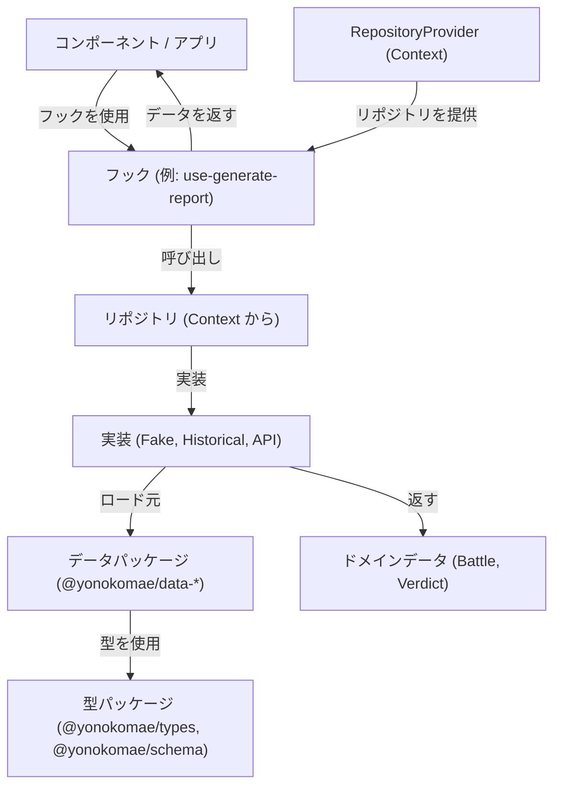
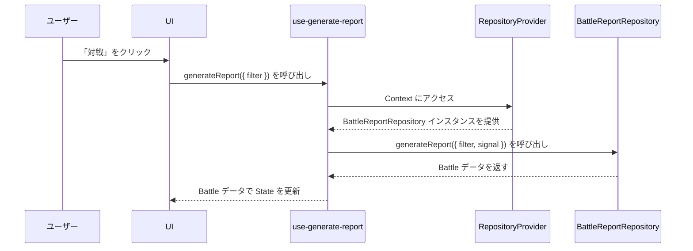
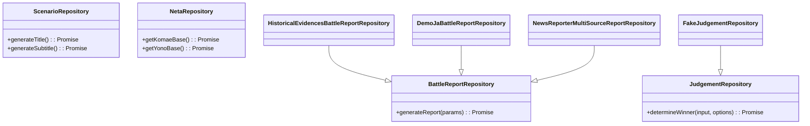

# 開発ガイド(開発者向け)

## アーキテクチャ概要

このアプリケーションは、関心事の分離が明確な pnpm monorepo アーキテクチャを採用しています。中心となる概念は以下の通りです。

- **Components**: レンダリングとユーザーインタラクションを担当する UI 要素。
- **Repositories**: データソース（データパッケージ、API など）を抽象化するデータアクセス層。
- **Play Modes**: 特定のシナリオで使用されるリポジトリ実装を決定する設定。
- **RepositoryProvider**: 選択された Play Mode に基づいて、適切なリポジトリ実装を注入（inject）する React の Context Provider。
- **Hooks**: リポジトリとのインタラクションロジックをカプセル化するカスタム React フック（`use-generate-report`, `use-judgement`）。
- **データパッケージ**: ゲームデータを含む独立パッケージ（`data/battle-seeds/`, `data/historical-evidence/`, `data/news-seeds/`）。
- **型パッケージ**: 共有型定義（`packages/types/`）と検証スキーマ（`packages/schema/`）。

> 注: 以下に現れる `src/yk/...` 等のパスはすべて `packages/app/` を基準とした相対パスです。リポジトリ直下に `src/` ディレクトリは存在せず、アプリコードは `packages/app/src/` 配下にあります。

### データフローと依存性注入 (Dependency Injection)

`RepositoryProvider` は、依存性注入の中心的な役割を担います。これにより、コンポーネントはアクティブな Play Mode に応じた正しいリポジトリインスタンスを受け取ることができます。



### シーケンス図: バトルレポートの生成



### リポジトリのインターフェース

中心となるリポジトリの契約（interfaces）は `src/yk/repo/core/repositories.ts` に定義されています。リポジトリは独立データパッケージからデータを消費します。



## 新しい Play Mode または Repository の追加方法

このセクションでは、新しいリポジトリや Play Mode でアプリケーションを拡張する方法を説明します。

### バトルシード生成とテーマグルーピング

`@yonokomae/data-battle-seeds` は自動インデックス生成を行います。ジェネレータ
(`data/battle-seeds/scripts/generate-battle-index.ts`) が `src/battle/` を走査し、
`__generated/index.generated.ts` を生成して以下を提供します:

- `publishedBattleMap`, `draftBattleMap` と各 publishState のマップ (`battleMapsByPublishState`)
- `publishStateKeys`, `battleSeedsByPublishState`, まとめ用 `allBattleMap`
- UI 利便性のための `battlesByThemeId` と `themeIds` (各テーマ配列は battle id でソート)
- `ThemeId` 型 (`keyof typeof battlesByThemeId`)

ルール / 振る舞い:

1. `publishState` が無い場合は `published` とみなし警告
2. basename または battle `id` の重複はエラー終了
3. 対象は `*.ja.ts` のみ。`__drafts/` 位置は補助であり `publishState` が唯一のソースオブトゥルース
4. 生成は静的 import のみ (tree-shaking 可能)

新しいバトルシード追加:

```bash
cp data/battle-seeds/src/battle/theme/<theme>/example.ja.ts \
     data/battle-seeds/src/battle/theme/<theme>/new-id.ja.ts
# メタデータ編集 (id, title, subtitle, narrative, publishState, significance)
pnpm --filter @yonokomae/data-battle-seeds run generate:battles
```

グルーピング利用例 (アプリ側):

```ts
import {
    battlesByThemeId,
    themeIds,
    ThemeId,
} from '@yonokomae/data-battle-seeds';

function getThemeBattles(theme: ThemeId) {
    return battlesByThemeId[theme] ?? [];
}
```

シードパッケージのみ手動ビルド:

```bash
pnpm -w run build:packages
pnpm --filter @yonokomae/data-battle-seeds build
```

ジェネレータのみ実行:

```bash
pnpm --filter @yonokomae/data-battle-seeds run generate:battles
```

落とし穴:

- `@yonokomae/types` ビルド前にシードを単体ビルドし失敗するケース
- 生成ファイルを直接編集してしまう (必ずジェネレータ再実行)

### publishState と テーマ別バトルシード構造

バトルシードに `publishState` ライフサイクルとテーマ階層 (`theme/{themeName}/` + `__drafts/`) を導入。

目的:

- 未完成案の分離でキュレーション容易化
- 非公開状態の UI 可視化 (`PublishStateChip` は非 `published` のみ表示)
- 将来の編集/レビュー導線準備

状態:

| 状態 | 意味 | UI 振る舞い |
|------|------|-------------|
| `published` | 正式公開 | チップ非表示 |
| `draft` | 初期案 / 未完成 | チップ表示 |
| `review` | 検証 / 編集待ち | チップ表示 |
| `archived` | 退役 / 置換済み | チップ表示 |

ルール:

1. `__drafts/` 内は必ず `publishState !== 'published'`。
2. 欠落は後方互換のため `published` とみなす (将来警告予定)。
3. 表示チップは非 `published` のみ。
4. フィルタは theme + publishState を合成。未知値は明示フィルタ無い場合 `published` として扱う。

インデックス生成スクリプト:

- `generate-battle-index.ts` 全シード + 正規化 state
- `generate-draft-index.ts` 非 `published` の列挙

新しい state を追加する手順:

1. ジェネレータ正規表現と `publishStateKeys` にリテラル追加
2. UI ラベルマップ (`PublishStateChip`) 更新
3. 正規化 fallback を確認 (未知→`published`)
4. テスト追加: 分類 + チップ + フィルタ + 無効 option
5. ドキュメント EN→JA 同期 + CHANGELOG 追記

テストでカバーしている境界:

- `publishState` 欠落 (published にフォールバック)
- 0 件 state の無効化 option
- theme + publishState の積集合フィルタ

今後の予定:

- archived 専用トグル
- 状態遷移 (draft→review→published) 支援ツール

### 新しい Repository の追加

1. **Repository 実装の作成:**
   `src/yk/repo/` 以下に新しいファイルを作成します。例: `src/yk/repo/example/repositories.example.ts`。一つ以上のリポジトリインターフェースを実装します。

    ```typescript
    // src/yk/repo/example/repositories.example.ts
    import type { BattleReportRepository } from '@/yk/repo/core/repositories';
    import type { Battle } from '@yonokomae/types';
    import { uid } from '@/lib/id';

    export class ExampleBattleReportRepository
        implements BattleReportRepository
    {
        async generateReport(params?: {
            filter?: { battle?: { themeId?: string } };
            signal?: AbortSignal;
        }): Promise<Battle> {
            // 任意: params.filter で選択を絞り込み
            // 任意: params.signal を尊重 (Abort 対応)
            return {
                id: uid('battle'),
                title: 'Example Battle',
                themeId: params?.filter?.battle?.themeId ?? 'example',
                significance: 'low',
                subtitle: 'Demo',
                narrative: { overview: '', scenario: '' },
                yono: {
                    imageUrl: '',
                    title: 'Yono',
                    subtitle: '',
                    description: '',
                    power: 50,
                },
                komae: {
                    imageUrl: '',
                    title: 'Komae',
                    subtitle: '',
                    description: '',
                    power: 50,
                },
                status: 'success',
            } as Battle;
        }
    }
    ```

2. **Provider Factory への接続:**
   `src/yk/repo/core/repository-provider.ts` 内のファクトリ関数（`getBattleReportRepository`, `getJudgementRepository` など）を更新し、目的の Play Mode に対して新しいリポジトリ実装を返すようにします。

    ```typescript
    // src/yk/repo/core/repository-provider.ts
    import { ExampleBattleReportRepository } from '@/yk/repo/example/repositories.example';

    export async function getBattleReportRepository(
        mode?: PlayMode,
    ): Promise<BattleReportRepository> {
        if (mode?.id === 'some-mode') {
            return new ExampleBattleReportRepository();
        }
        // ... other modes
    }
    ```

#### 統一された generateReport パラメータ

すべての `BattleReportRepository` は単一の任意パラメータオブジェクトを受け取ります:

```ts
interface GenerateBattleReportParams {
    filter?: {
        battle?: {
            id?: string;
            themeId?: string;
            significance?: Battle['significance'];
        };
    };
    signal?: AbortSignal;
}

// 使用例
await repo.generateReport(); // ランダム取得
await repo.generateReport({ filter: { battle: { themeId: 'history' } } });
const controller = new AbortController();
await repo.generateReport({ signal: controller.signal });
```

指針:

- `signal` のみでも常に単一オブジェクトで渡す。
- 新しいフィルタ項目は慎重に追加し、まずは `filter.battle` 下に平坦配置。
- 追加したフィールドを各実装が未対応の場合は無視される旨をドキュメント化。

### 新しい Play Mode の追加

1. **Play Mode の定義:**
   `src/yk/play-mode.ts` に新しい `PlayMode` オブジェクトを追加します。

    ```typescript
    // src/yk/play-mode.ts
    import type { PlayMode } from '@yonokomae/types';

    export const exampleMode: PlayMode = {
        id: 'example-mode',
        title: 'EXAMPLE MODE',
        description: 'A new mode powered by ExampleRepo',
        enabled: true,
    };
    ```

2. **Repositories の実装:**
   上記で説明したように、新しいモード用のリポジトリ実装を作成します。

3. **Provider Factories の更新:**
   `src/yk/repo/core/repository-provider.ts` のファクトリ関数に、新しい `example-mode` を処理するための分岐を追加します。動的インポート（dynamic import）を使用してリポジトリを遅延読み込みします。

    ```typescript
    // src/yk/repo/core/repository-provider.ts
    export async function getBattleReportRepository(
        mode?: PlayMode,
    ): Promise<BattleReportRepository> {
        if (mode?.id === 'example-mode') {
            const { ExampleBattleReportRepository } = await import(
                '@/yk/repo/example/repositories.example'
            );
            return new ExampleBattleReportRepository();
        }
        // ... other modes
    }
    ```

4. **UI での Mode の使用:**
   UI を更新して新しい Play Mode を選択できるようにし、そのモードが `RepositoryProvider` に渡されるようにします。

### 環境変数 (Environment Variables)

`.env.example` はサポートされる Vite 環境変数一覧です。以下のいずれかへコピーして利用します:

- `.env` (全モード共有)
- `.env.local` (ローカル上書き / git ignore 対象)
- `.env.development`
- `.env.production`

ルール:

- `VITE_` 接頭辞のみクライアントコードへ露出
- 追加/削除後は dev サーバ再起動 (Vite キャッシュ反映)
- 秘密情報はコミットしない (公開前提の値のみ)

サポート変数 (詳細とデフォルトは `.env.example` 内コメント参照):

| Name                            | Purpose                                                    |
| ------------------------------- | ---------------------------------------------------------- |
| `VITE_API_BASE_URL`             | Backend API のベースパスまたは絶対 URL (デフォルト `/api`) |
| `VITE_LOG_JUDGEMENT_CACHE`      | judgement collapse キャッシュのヒット/ミス詳細ログ         |
| `VITE_LOG_JUDGEMENT_TIMING`     | 処理時間 + 重複呼出し警告ログ                              |
| `VITE_LOG_HISTORICAL_REPORTS`   | historical report repository の詳細ログ                    |
| `VITE_NEWS_REPORT_CACHE_TTL_MS` | news reporter HTTP 応答のキャッシュ TTL (ms)               |
| `VITE_BATTLE_RANDOM_WEIGHT_API` | API vs ローカルデータ選択ブレンド重み (0..1)               |
| `VITE_BASE_PATH`                | サブディレクトリ配備時のビルド時ベースパス                 |

環境変数ではない (コード構成): judgement collapse のデフォルトは `packages/app/src/yk/repo/core/judgement-config.ts` に存在。

## Workspace と依存関係管理

単一の pnpm workspace (`pnpm-workspace.yaml`) を用い 3 つのグロブを定義:

```yaml
packages:
    - 'packages/*' # app, catalog, schema, types (ライブラリ / アプリコード)
    - 'data/*' # シードデータパッケージ
    - 'packages/app' # 明示的パス (順序意図の明確化)
```

### 内部パッケージ命名

- アプリ: `@yonokomae/app`
- ライブラリ: `@yonokomae/types`, `@yonokomae/schema`, `@yonokomae/catalog`
- データ: `@yonokomae/data-battle-seeds`, `@yonokomae/data-historical-evidence`, `@yonokomae/data-news-seeds`

クロス依存は常に `workspace:*`。

### 新規内部ライブラリ追加フロー

1. `packages/<name>/` 作成
2. `package.json` 作成（exports / dist 指定）
3. `tsconfig.role.package.json` (又は seed 用 role) 継承 tsconfig
4. 実装を `src/` 配下へ配置
5. `pnpm install`
6. 公開 API 変更ならドキュメント/用語更新

### データパッケージ追加

既存のいずれかを複製し対称性維持。ビルド/テストは app に集中。tsconfig は 3 つの seed と揃える。

### 依存ポリシー

- runtime 必須のみ `dependencies`
- ビルド/テスト/型のみは `devDependencies`
- seed/data に重量依存禁止
- 共有ロジックが複数箇所に出たら新パッケージ化検討
- 逆方向 (`@yonokomae/app` への依存) 禁止
- グラフは非循環: data -> (types/schema), libs -> (types/schema), app -> all

### バージョニング & Changeset

`.changeset/` を利用:

- 公開 API/スキーマ意味変更で追加
- conventional prefix 使用
- 破壊的なら scope に `!`

### よく使う pnpm フィルタ

```bash
pnpm --filter @yonokomae/app dev
pnpm --filter @yonokomae/types test
pnpm --filter ./data/battle-seeds build
pnpm -r exec echo {name}
```

### ビルド順序

1. types / schema / catalog
2. data
3. app

`pnpm -r --sort build` と Project References で順序保証。

### トラブルシュート

| 症状                    | 原因                         | 対処                                |
| ----------------------- | ---------------------------- | ----------------------------------- |
| 型が見えない            | references 不備/ビルド未更新 | `pnpm -r build` 再 typecheck        |
| 古い d.ts               | 旧 `.types` 残存             | `node_modules/.types` 削除→再ビルド |
| 意図しない version bump | changeset 不備               | changeset 追加/修正                 |

### パッケージ分割判断

- app & data 両方で再利用
- 不関連変更で app ビルド遅延
- 安定したドメイン概念抽出価値あり

該当なしなら分割しない。

## テスト

詳細なテストガイドラインについては、[TESTING.md](TESTING.md) を参照してください。

### エンドツーエンド (E2E) テスト方針

E2E テストには Playwright を使用します。テスト仕様 (spec) は `e2e/` ディレクトリにあります。

**テスト原則:**

- **焦点**: 実装詳細ではなく、ユーザー向けの動作をテストします。
- **アクセシビリティ**: 重要なコントロールには `getByRole` を使用してアクセス可能な名前とロールをアサートします。
- **ロケータ**: 堅牢性のためにロールベースのロケータを優先します。セマンティックなロールを持たない要素には `data-testid` を控えめに使用します。
- **決定性**: 任意の待機処理を避け、Playwright の Web-first assertions と自動待機を使用します。
- **パフォーマンス**: 長時間実行されるテストには `@performance` タグを付けます。

**テストコマンド:**

- `pnpm run e2e` - E2E テスト実行 (@performance を除く)
- `pnpm run e2e:all` - 全ての E2E テスト実行 (@performance を含む)
- `pnpm run e2e:ui` - インタラクティブ UI モード
- `pnpm run e2e:headed` - ヘッドモードで実行 (Chromium)

#### 開発専用インストルメンテーションと本番整合性

一部タイトル操作 E2E で使用されていたグローバルカウンタ
`window.__YK_TEST_ONSELECT_COUNT__` は dev/test ビルドのみで増加し、本番バンドルからは
除外されます。この依存関係を持つ E2E は削除し、本番挙動との整合性を優先します。今後の指針:

- 可視状態 (選択スタイル / aria-selected) やアクセシブルネームを直接アサート
- やむを得ず計測が必要な場合のみ明示的フラグ (例: `VITE_ENABLE_E2E_INSTR`) を導入し契約を文書化
- 隠れたグローバルよりセマンティックロールを優先; 役割が無い場合のみ `data-testid` を控えめに使用

#### iOS / WebKit タッチ選択補正

iOS Safari でタップ時に意図しないモードが選択される事象を解消するため、縦座標に最も近い要素へ
補正するロジックを導入しました。本ロジックは実デバイス判定 (UA + マルチタッチ) 下かつクリック
座標が取得できる場合にのみ動作し、デスクトップおよびテスト環境 (NODE_ENV === 'test') では無効です。
実装は `TitleContainer` 内に存在します。

**データパッケージのテスト:**

- `pnpm test` - データパッケージ検証を含む全てのテストを実行
- `pnpm run test:seeds` - 全シードデータの検証
- `cd data/{package} && pnpm test` - 個別のデータパッケージをテスト

### コンポーネントテスト

コンポーネントテストには Vitest と React Testing Library を使用しています:

- `pnpm run test:unit` - ユニットテストを実行
- `pnpm run test:storybook` - ブラウザで Storybook テストを実行
- `pnpm run test:coverage` - カバレッジレポートを生成

## TypeScript ビルド構成

このリポジトリはレイヤード tsconfig 戦略を用いて、厳格性 / エディタ反応速度 / 一貫した型生成を両立しています:

- `tsconfig.base.json`: 共有の厳格デフォルト (ルート tsconfig 側で noEmit 指定)。DOM/Node 依存なし。
- `tsconfig.env.dom.json` / `tsconfig.env.node.json`: 環境別ライブラリ設定 (DOM vs NodeNext)。
- `tsconfig.role.app.json`: Web アプリ用 (React / JSX / 型のみ出力 `.types/app`)。Vite / shadcn/ui 互換のため `allowImportingTsExtensions` を有効化し副作用安全系フラグも追加。
- `packages/app/tsconfig.json`: パッケージエントリ (`baseUrl` / paths / declarationDir 設定)。
- `tsconfig.role.package.json`: 汎用ライブラリロール (出力先 `dist`)。
- `packages/{types,schema,catalog}/tsconfig.json`: role.package を薄く継承し `rootDir` と `outDir` のみ設定。
- `tsconfig.role.seed.json`: シードデータビルド用 (DOM 環境 + composite)。
- `data/*/tsconfig.json`: 3 つのシードパッケージ (battle, news, historical) は対称性のため完全に同一。
- `tsconfig.ops.json`: 運用/CLI 用 Node 環境 (出力 `dist/ops-build/ops`)。

> 注 (2025-09-06): `packages/app/tsconfig.app.json` は参照が無いことを確認後に削除済みです。今後は `tsconfig.role.app.json` (ロール設定) + `packages/app/tsconfig.json` (パッケージエントリ) の組み合わせのみを使用してください。

ガイドライン:

1. 新しい role の追加は最小限にし既存継承を優先。
2. 環境 (DOM/Node) とパッケージ役割を分離。
3. JS 出力はバンドラ (Vite) に任せ型のみ emit を優先。
4. シード tsconfig を変更する際は 3 つ全てを同期 (もしくは共有 role 追加で重複排除)。
5. 非標準フラグの理由は近接する tsconfig コメントに記述。

`allowImportingTsExtensions` の理由: 明示的 `.ts/.tsx` 拡張子に依存する一部 UI テンプレート/コードモッドとの摩擦を避けるため。

## エラークラス (Error Classes)

カスタムエラー階層で診断性向上:

- `BattleSeedError` -> `BattleSeedNotFoundError`, `BattleSeedValidationError`
- `NewsReporterError` -> `NewsReporterHttpError`, `NewsReporterDataError`

指針:

1. 最も具体的な型を throw
2. 重要経路はテストで `instanceof` アサート
3. CLI ユーザー向けメッセージは安定維持

## CLI オペレーションスクリプト

`src/ops/` 配下 (全て `-h` / `--help` 対応)。統一準備スクリプト `pnpm run ops:prepare` は以下を行います:

1. すべての `@yonokomae/data-*` パッケージをビルド (battle 統合インデックス / all-battles JSON 生成含む)
2. ops スクリプトを `dist/ops-build/ops/` にビルド

各個別コマンドは必要に応じ最小限の準備を自動実行します。クリーン再ビルドが必要な場合のみ手動で `ops:prepare` を実行してください。

スクリプト一覧:

- `export-battle-seeds-to-json.ts` – 事前生成された統合 battles JSON をファイルまたは stdout にコピー
- `export-users-voice-to-tsv.ts` – user voice を TSV 出力
- `export-usage-examples-to-tsv.ts` – usage examples を TSV 出力
- `analyze-battle-seeds.ts` – battle seeds 統計を集計 / クロスタブ表示 (生成モジュールまたは JSON 入力)

使用例:

```bash
# 任意: フル準備を強制
pnpm run ops:prepare

# 推奨: pnpm scripts 経由 (必要なら自動ビルド)
pnpm run ops:export-battle-seeds-to-json -- out/battles.json
pnpm run ops:export-users-voice-to-tsv -- out/users-voice.tsv
pnpm run ops:export-usage-examples-to-tsv -- out/usage-examples.tsv

# 直接解析 (生成モジュール読み込み)
pnpm run ops:analyze-battle-seeds

# エクスポート済み JSON を解析
pnpm run ops:analyze-battle-seeds -- out/battles.json

# JSON 形式出力 (CI / 自動化向け)
pnpm run ops:analyze-battle-seeds -- --format=json

# 任意: 直接 node 実行 (ops:prepare 済み前提)
# node dist/ops-build/ops/export-battle-seeds-to-json.js out/battles.json
```

ヘルプ表示例:

```bash
pnpm run ops:export-users-voice-to-tsv -- --help
```

### Battle Seeds Analyzer 詳細

`analyze-battle-seeds.ts` は以下を出力:

- 総件数
- `themeId` 別件数 / 割合
- `significance` 別件数 / 割合
- テーマ × 重要度 クロスタブ (matrix)
- power 統計 (komae / yono / combined の min / max / avg)
- combined power 上位5件 (komae.power + yono.power)
- `publishState` 別分布 (published / draft / review / archived など)
- 未公開 (`draftIds`) battle id 一覧 (差分/トリアージ用)

自動化ヒント:

- `--format=json` で機械可読: 分布のドリフト検知や CI 比較に利用可能
- `jq` 例: `pnpm run ops:analyze-battle-seeds -- --format=json | jq '.byTheme.history'`
- データ更新後に統計サマリのアーティファクト化に活用
- フィルタフラグ: `--published-only` または `--drafts-only` (同時指定不可)

テスト: `src/ops/__tests__/export-cli.test.ts` 参照。

## 決定的シャッフル (Deterministic Shuffle)

`shuffleArraySeeded` でテストの再現性確保:

1. シャッフル順序に依存するアサーション
2. 複数環境で安定出力比較

本番経路へは再現性要件が明確でない限り導入しない。

## 移行ノート

### 破壊的変更 (2025-09-02): `Winner` -> `Verdict`

`JudgementRepository.determineWinner` メソッドは、単純な `Winner` 文字列の代わりに、構造化された `Verdict` オブジェクトを返すようになりました。

- **旧:** `Promise<'YONO' | 'KOMAE' | 'DRAW'>`
- **新:** `Promise<Verdict>`

```typescript
type Verdict = {
    winner: 'YONO' | 'KOMAE' | 'DRAW';
    reason: 'bias-hit' | 'power' | 'api' | 'default' | 'near-tie';
    judgeCode?: string;
    /** yono.power - komae.power */
    powerDiff?: number;
    /** ランダム性が関与する場合の 0..1 サンプル値 */
    rng?: number;
    /** 将来のモデルベース判定向け信頼度 (0..1) */
    confidence?: number;
};
```

**対応が必要な作業:**

- すべての呼び出し箇所を、`verdict.winner` を介して勝者にアクセスするように更新してください。
- すべての `JudgementRepository` 実装が `Verdict` オブジェクトを返すようにしてください。
- テストとモックを、新しい戻り値の型に一致するように更新してください。

### インフラ変更 (2025-09-06): `packages/app/tsconfig.app.json` の削除

歴史的な暫定ファイルを重複/乖離リスク低減のため削除しました。

理由:

- Editor / CI / build は `tsconfig.role.app.json` + `packages/app/tsconfig.json` で解決可能
- 宣言出力設定の二重化を排除
- JSX / moduleResolution 等のフラグ乖離リスク排除

対応:

- ローカルで旧ファイルを直接参照するエディタ設定が残っていれば `packages/app/tsconfig.json` に切替
- コード変更不要 (ビルドグラフ影響なし)

## 現在の Play Mode

- `demo`: 固定シナリオによる日本語のデモ。
- `demo-en`: 英語のデモ。
- `demo-de`: ドイツ語のデモ。
- `historical-research`: `@yonokomae/data-historical-evidence` からの歴史的証拠シードに基づいたシナリオ。
- `yk-now`: `@yonokomae/data-news-seeds` からのデータを使用したニュース駆動モード。

## UI コンポーネント

### バトルコンポーネント

- **HistoricalScene**: ローディング状態とメタデータ表示を備えたメインバトル表示コンポーネント
    - 設定可能なアスペクト比でクロップドバナーモードをサポート
    - 重要度チップとテーマバッジを含む
    - ローディングスケルトン状態を処理

- **FontSizeControl**: レスポンシブなフォントサイズ調整コントロール
    - モバイルデバイス用のコンパクトモード
    - キーボードショートカットサポート (Alt+Plus/Minus)

### アクセシビリティ機能

- **ReducedMotionModeToggle**: ユーザーのモーション設定を尊重
- **キーボードショートカット**: Controller コンポーネントはキーボードナビゲーションをサポート (B でバトル、R でリセット)
- **ARIA 属性**: スクリーンリーダー用の適切なラベリングとライブリージョン

## データメンテナンス

バトルデータ、歴史的シナリオ、ニュースサンプルで作業するデータメンテナ向け:

- **メインガイド**: [DATA_MAINTENANCE_JA.md](DATA_MAINTENANCE_JA.md) を参照
- **バトルデータ**: [data/BATTLE_SEEDS_JA.md](data/BATTLE_SEEDS_JA.md) を参照
- **歴史的証拠**: [data/HISTORICAL_EVIDENCE_SEEDS_JA.md](data/HISTORICAL_EVIDENCE_SEEDS_JA.md) を参照
- **ニュースシード**: [data/NEWS_SEEDS_JA.md](data/NEWS_SEEDS_JA.md) を参照

## パッケージ構造

```text
yonokomae/
├── packages/
│   ├── app/                      # メイン Web アプリ (React / hooks / repos)
│   ├── catalog/                  # ドメインカタログ / 列挙
│   ├── types/                    # 共有 TypeScript 型
│   └── schema/                   # Zod 検証スキーマ
├── data/
│   ├── battle-seeds/             # 統計バトルデータ
│   ├── historical-evidence/      # 歴史シナリオデータ
│   └── news-seeds/               # ニュース風サンプルデータ
├── docs/                         # ドキュメント (英語がソース)
├── e2e/                          # E2E テスト (Playwright)
├── mock-api/                     # ローカルモック API サーバ
└── (リポジトリ直下に root src/ は存在せず、アプリコードは packages/app/src/ 配下)
```

### リポジトリ層フィルタリング UI (`BattleFilter`)

`BattleFilter` はリポジトリ層でバトル生成対象集合を制約するための UI です。旧 `BattleSeedFilter` は表示中シードリストのみを UI 側で絞るものでしたが、現在は `BattleReportRepository.generateReport({ filter })` のパラメータとして渡しデータ取得段階で絞り込みます。

現時点の機能:

- テーマ絞り込み (`filter.battle.themeId` 注入)
- 未選択時は全プールからランダムフォールバック

最近の関連拡張:

- `BattleSeedSelector` に `showIds` (任意) を追加し内部 battle id を QA / 再現性確認向けに表示
- `BattleTitleChip` に `showThemeIcon` (任意) を追加しテーマアイコンを表示 (アクセシブルネームは安定)

将来予定 (未実装):

- 重要度フィルタ (`filter.battle.significance`)
- 明示的 id 指定 (`filter.battle.id`) による決定的再生成

新フィルタフィールド追加手順:

1. `repositories.ts` の `GenerateBattleReportParams` を拡張
2. 各実装で対応 (又は無視を明記)
3. 絞り込み/ランダム性を検証するテストを追加
4. 英語版更新後に本ファイル同期
