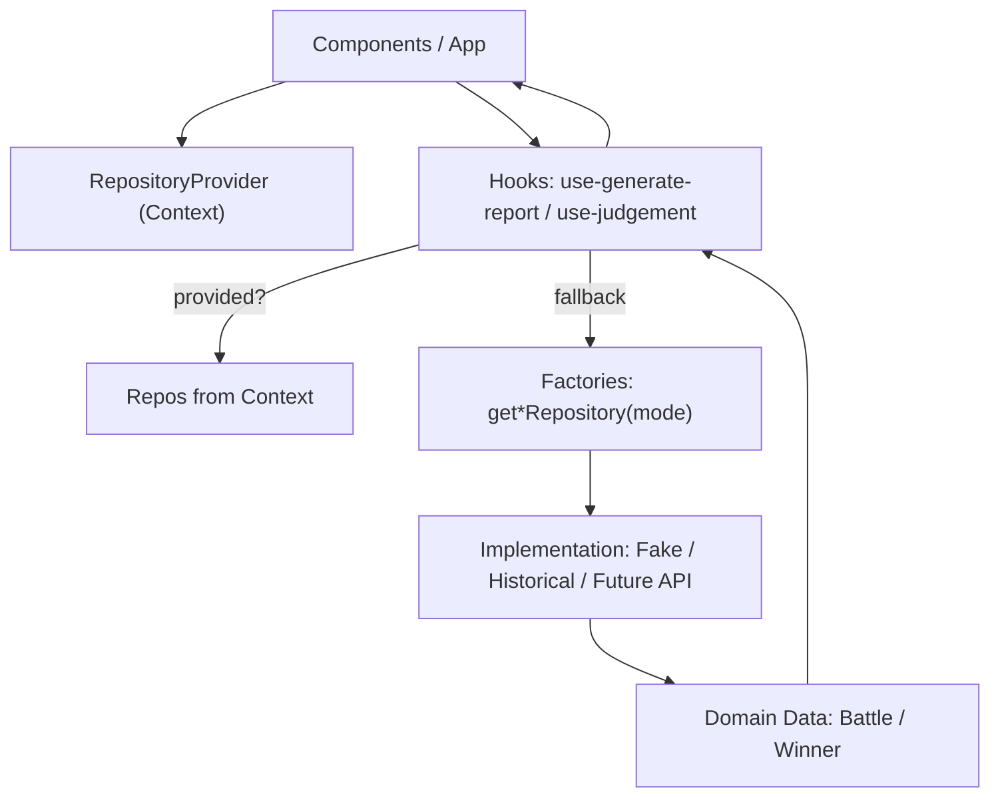
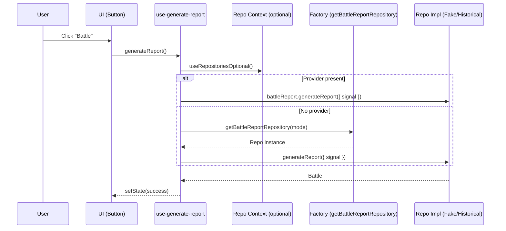
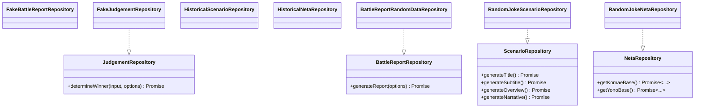

<!--
Dear AIs.
This document should be written in Japanese.
Please use half-width characters for numbers, letters, and symbols.
-->

# 開発ガイド(開発者向け)

## アーキテクチャ概要

このアーキテクチャはモジュラーデザインを採用し、コンポーネント、リポジトリ、プレイモード間の関心を明確に分離します。主な構成要素は次のとおりです:

- コンポーネント: ユーザーと対話する UI コンポーネント。
- RepositoryProvider: コンポーネントへ適切なリポジトリ実装を供給するコンテキストプロバイダ。
- フック: リポジトリとのやり取りのロジックをカプセル化したカスタムフック。
- リポジトリ: 基盤データソースを抽象化するデータアクセス層。

## 新しい Play Mode または Repository の追加方法

このセクションは開発者向けです。ExampleRepo と ExampleMode を例に、Repository 実装の追加方法と Play Mode の追加方法を説明します。コード例は TypeScript で、TSDoc コメント付きです。

注: アプリは CSR の SPA(SSR なし)です。依存性注入(DI)は `RepositoryProvider`(非同期初期化には `RepositoryProviderSuspense`)で提供されます。

### 目標と契約(Contracts)

- 明確なリポジトリ契約は `src/yk/repo/core/repositories.ts` に定義されています。
- 実装は `src/yk/repo/*` 配下に置きます。
- Play Mode は `src/yk/play-mode.ts` で定義されます。
- 具体的なリポジトリを返すプロバイダファクトリは `src/yk/repo/core/repository-provider.ts` にあります。

コアインターフェイス:

- `BattleReportRepository`
- `JudgementRepository`
- `ScenarioRepository`
- `NetaRepository`

### アーキテクチャ図(Mermaid)

データと DI の高レベルフロー:



バトルレポート生成のシーケンス:



インターフェイスと実装:



### 既存 Play Mode 向けに新しい Repository を追加する

既存モード(例: `demo`)の下で新しいリポジトリ(ExampleRepo)を追加して利用する場合の手順です。

注: リポジトリ実装は `src/yk/repo/` 配下で種類別に整理されています:

- `api/` - REST API クライアント実装
- `core/` - Repository インターフェイスとプロバイダロジック
- `demo/` - デモ/固定データリポジトリ
- `historical-evidences/` - 厳選された歴史データリポジトリ
- `mock/` - テスト/偽リポジトリ(FakeJudgementRepository のみ)
- `random-jokes/` - シードベースのランダムデータリポジトリ(デフォルト)
- `seed-system/` - 歴史的シード管理システム

1. Repository 実装ファイルを作成

- 位置: `src/yk/repo/example/repositories.example.ts`

TSDoc 付きの例:

```ts
// src/yk/repo/example/repositories.example.ts
import type {
    BattleReportRepository,
    JudgementRepository,
    Winner,
} from '@/yk/repo/core/repositories';
import type { Battle, Neta } from '@/types/types';
import { uid } from '@/lib/id';

/**
 * ExampleBattleReportRepository
 * @public
 * Battle エンティティを生成するサンプル実装。
 */
export class ExampleBattleReportRepository implements BattleReportRepository {
    /**
     * バトルレポートを生成または取得します。
     * @param options キャンセル用の signal などのオプション。
     * @returns 完全に構築された Battle エンティティ。
     */
    async generateReport(options?: { signal?: AbortSignal }): Promise<Battle> {
        // 実使用まで lint 回避のため options を参照
        void options?.signal;
        const makeNeta = (title: string): Neta => ({
            title,
            subtitle: 'Example Subtitle',
            description: 'Generated by ExampleRepo',
            imageUrl: 'about:blank',
            power: 42,
        });
        return {
            id: uid('battle'),
            title: 'Example Battle',
            subtitle: 'Showcase',
            overview: 'An example implementation for Battle reports',
            scenario: 'Two sides face off in a demonstration scenario.',
            yono: makeNeta('Yono - Example'),
            komae: makeNeta('Komae - Example'),
            status: 'success',
        };
    }
}

/**
 * ExampleJudgementRepository
 * @public
 * 勝者を決定する単純なルールのデモ。
 */
export class ExampleJudgementRepository implements JudgementRepository {
    /**
     * 与えられた入力に基づいて勝者を決定します。
     * @param input 現在の mode と 2 体の競技者を含みます。
     * @param options キャンセル用の signal などのオプション。
     * @returns 勝者 id: 'YONO'、'KOMAE'、または 'DRAW'。
     */
    async determineWinner(
        input: { mode: { id: string }; yono: Neta; komae: Neta },
        options?: { signal?: AbortSignal },
    ): Promise<Winner> {
        void options?.signal;
        if (input.yono.power === input.komae.power) {
            return 'DRAW';
        }
        return input.yono.power > input.komae.power ? 'YONO' : 'KOMAE';
    }
}
```

2. 既存モードに ExampleRepo を配線

- ファイル: `src/yk/repo/core/repository-provider.ts`
- `mode.id` が対象モード(例: `demo`)に一致する場合、`ExampleBattleReportRepository` と `ExampleJudgementRepository` を返す分岐を追加します。

3. (任意) モードごとのデフォルト遅延を調整

- ヘルパ `defaultDelayForMode` を調整して、モード/リポジトリ種別に応じた現実的なレイテンシを模擬します。

4. 実装近傍にテストを追加

- ファイル: `src/yk/repo/example/repositories.example.test.ts`
- タイマー/乱数は必要に応じてモックし、ランダム値ではなく状態や相互作用を検証します。

### 新しい Play Mode とその Repository を追加する

新しい `ExampleMode` と新しいリポジトリ群を導入する場合の手順です。

1. Play Mode を登録

- ファイル: `src/yk/play-mode.ts`
- `playMode` に項目を追加:

```ts
// @ts-nocheck
{
type PlayMode = { id: string; title: string; description: string; enabled: boolean };
    title: 'EXAMPLE MODE',
  id: 'example-mode',
  title: 'EXAMPLE MODE',
  description: 'A new mode powered by ExampleRepo',
  enabled: true,

2. Repository を実装

- 位置: `src/yk/repo/example/repositories.example.ts`(上記と同じ。必要であれば分割)

3. プロバイダファクトリにモード配線を追加

- ファイル: `src/yk/repo/core/repository-provider.ts`
- `getBattleReportRepository` と `getJudgementRepository` に分岐を追加:

```ts
if (mode?.id === 'example-mode') {
    const { ExampleBattleReportRepository } = await import(
        '@/yk/repo/example/repositories.example'
    );
    return new ExampleBattleReportRepository();
}
// ...
if (mode?.id === 'example-mode') {
    const { ExampleJudgementRepository } = await import(
        '@/yk/repo/example/repositories.example'
    );
    return new ExampleJudgementRepository();
}
```

4. UI またはテストでモードを選択

- ルートで `RepositoryProvider` に `mode={theExampleMode}` を渡す、または明示 DI を受け取るフック/コンポーネントへ `mode` を渡します。

5. 非同期初期化(ある場合)

- ExampleRepo が非同期セットアップ(API ウォームアップやメタデータ取得)を必要とする場合、`RepositoryProviderSuspense` と `<Suspense>` を使ってアプリシェルでラップします。

### Provider ファクトリでの配線

- プロバイダファクトリは `src/yk/repo/core/repository-provider.ts` にあります。
- `mode.id` ごとに適切な実装をインスタンス化する分岐を追加します。
- ファクトリは軽量で副作用を避け、可能な限り動的 import を利用してください。

### アプリでの Provider 利用(Suspense)

基本のプロバイダ(同期/遅延作成):

```tsx
import React from 'react';
import { RepositoryProvider } from '@/yk/repo/core/RepositoryProvider';
import { playMode, type PlayMode } from '@/yk/play-mode';

export function Root() {
    const [mode] = React.useState<PlayMode>(playMode[0]);
    return <RepositoryProvider mode={mode}>{/* App */}</RepositoryProvider>;
}
```

Suspense 対応プロバイダ(非同期初期化):

```tsx
import React, { Suspense } from 'react';
import { RepositoryProviderSuspense } from '@/yk/repo/core/RepositoryProvider';
import type { PlayMode } from '@/yk/play-mode';

export function Root({ mode }: { mode: PlayMode }) {
    return (
        <Suspense fallback={<div>Initializing…</div>}>
            <RepositoryProviderSuspense mode={mode}>
                {/* App */}
            </RepositoryProviderSuspense>
        </Suspense>
    );
}
```

### テストヘルパと Tips

テストガイドは [TESTING.md](./TESTING.md) を参照してください。

## End-to-End(E2E) テスト方針

E2E は Playwright を使用して、主要なユーザーフローとアクセシビリティ表面をカバーします。テストは速く、決定的で、ユーザーが体験する振る舞いに集中させます。

原則

- スコープ: spec は `e2e/` 配下に配置し、タスク指向に保つ。
- ロケータ: `getByRole(..., { name })` を優先; セマンティクスがないコンテナ(例: `battle`、`slot-yono`、`slot-komae`)にのみ `data-testid` を使用。脆い CSS/XPath は避ける。
- 決定性: 恣意的な待機は避け、`expect(...).toHave*` アサーションに依拠。`prefers-reduced-motion` を尊重し、必要に応じてテストでエミュレート。
- パフォーマンステスト: 長時間/高回数のフローは slow マークと `@performance` タグを付け、個別にフィルタ可能にする。
- アクセシビリティ: 重要なコントロールの role とアクセシブルネームを検証。

アノテーションとタグ

- タグは Playwright で grep 可能(例: `@performance`、`@a11y`、`@smoke`)。
- レポート注記が有用なら次を追加: `test.info().annotations.push({ type: 'performance', description: '...' })`。
- 参考: [Playwright Annotations](https://playwright.dev/docs/test-annotations)

例

```ts
import { test } from '@playwright/test';

test(
    'appends up to 100 battle containers when Battle is clicked repeatedly',
    {
        tag: ['@performance', '@slow'],
    },
    async ({ page }) => {
        // ... test body ...
    },
);

test('a long-running performance check', async ({ page }) => {
    test.slow();
    test.info().annotations.push({
        type: 'performance',
        description: 'Clicks Battle 100 times and verifies 100 containers',
    });
    // ... test body ...
});
```

### 受け入れチェックリスト

- TypeScript のコンパイルで新しいエラーがない。
- ユニットテストがローカルで通過している。
- 新モードがある場合、プロバイダファクトリの分岐が実装されている。
- 必要に応じて README/DEVELOPMENT_EN を更新(概要は README、詳細は本ドキュメント)。
