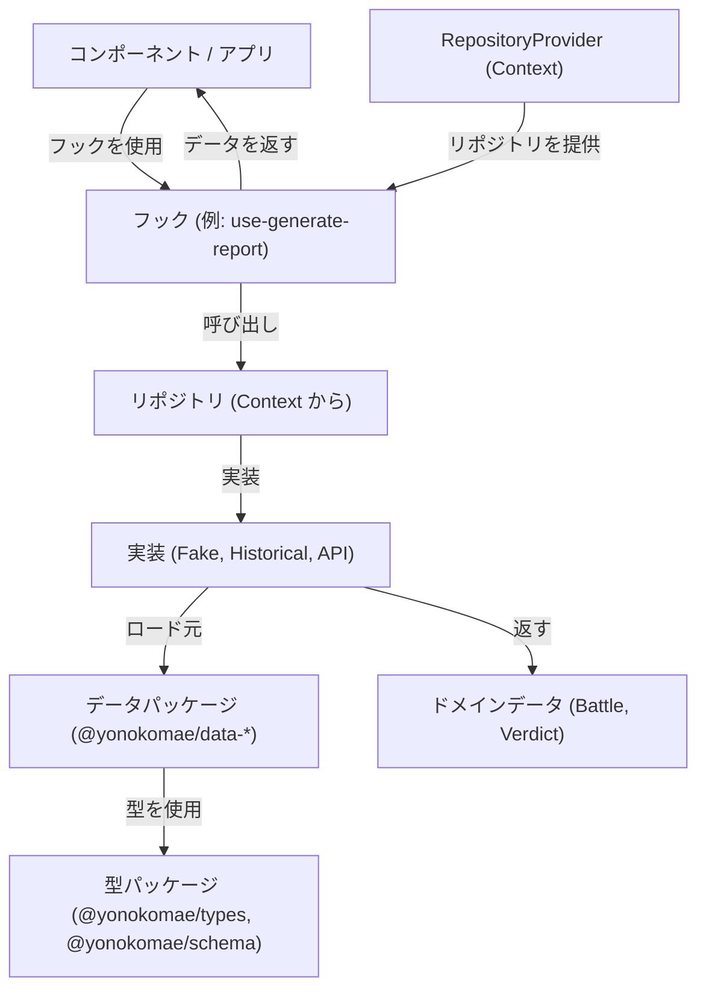
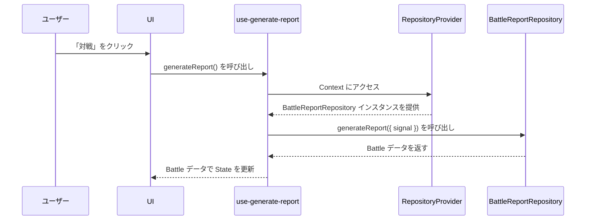
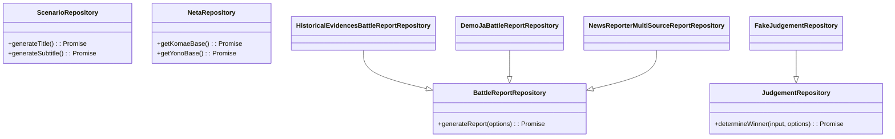

# 開発ガイド(開発者向け)

## アーキテクチャ概要

このアプリケーションは、関心事の分離が明確な pnpm monorepo アーキテクチャを採用しています。中心となる概念は以下の通りです。

- **Components**: レンダリングとユーザーインタラクションを担当する UI 要素。
- **Repositories**: データソース（データパッケージ、API など）を抽象化するデータアクセス層。
- **Play Modes**: 特定のシナリオで使用されるリポジトリ実装を決定する設定。
- **RepositoryProvider**: 選択された Play Mode に基づいて、適切なリポジトリ実装を注入（inject）する React の Context Provider。
- **Hooks**: リポジトリとのインタラクションロジックをカプセル化するカスタム React フック（`use-generate-report`, `use-judgement`）。
- **データパッケージ**: ゲームデータを含む独立パッケージ（`data/battle-seeds/`, `data/historical-evidence/`, `data/news-seeds/`）。
- **型パッケージ**: 共有型定義（`packages/types/`）と検証スキーマ（`packages/schema/`）。

### データフローと依存性注入 (Dependency Injection)

`RepositoryProvider` は、依存性注入の中心的な役割を担います。これにより、コンポーネントはアクティブな Play Mode に応じた正しいリポジトリインスタンスを受け取ることができます。



### シーケンス図: バトルレポートの生成



### リポジトリのインターフェース

中心となるリポジトリの契約（interfaces）は `src/yk/repo/core/repositories.ts` に定義されています。リポジトリは独立データパッケージからデータを消費します。



## 新しい Play Mode または Repository の追加方法

このセクションでは、新しいリポジトリや Play Mode でアプリケーションを拡張する方法を説明します。

### 新しい Repository の追加

1.  **Repository 実装の作成:**
    `src/yk/repo/` 以下に新しいファイルを作成します。例: `src/yk/repo/example/repositories.example.ts`。一つ以上のリポジトリインターフェースを実装します。

    ```typescript
    // src/yk/repo/example/repositories.example.ts
    import type { BattleReportRepository } from '@/yk/repo/core/repositories';
    import type { Battle } from '@yonokomae/types';
    import { uid } from '@/lib/id';

    export class ExampleBattleReportRepository
        implements BattleReportRepository
    {
        async generateReport(): Promise<Battle> {
            // データパッケージからデータをロード
            // const { battles } = await import('@yonokomae/data-battle-seeds');
            return {
                id: uid('battle'),
                title: 'Example Battle',
                // ... other properties
            };
        }
    }
    ```

2.  **Provider Factory への接続:**
    `src/yk/repo/core/repository-provider.ts` 内のファクトリ関数（`getBattleReportRepository`, `getJudgementRepository` など）を更新し、目的の Play Mode に対して新しいリポジトリ実装を返すようにします。

    ```typescript
    // src/yk/repo/core/repository-provider.ts
    import { ExampleBattleReportRepository } from '@/yk/repo/example/repositories.example';

    export async function getBattleReportRepository(
        mode?: PlayMode,
    ): Promise<BattleReportRepository> {
        if (mode?.id === 'some-mode') {
            return new ExampleBattleReportRepository();
        }
        // ... other modes
    }
    ```

### 新しい Play Mode の追加

1.  **Play Mode の定義:**
    `src/yk/play-mode.ts` に新しい `PlayMode` オブジェクトを追加します。

    ```typescript
    // src/yk/play-mode.ts
    import type { PlayMode } from '@yonokomae/types';

    export const exampleMode: PlayMode = {
        id: 'example-mode',
        title: 'EXAMPLE MODE',
        description: 'A new mode powered by ExampleRepo',
        enabled: true,
    };
    ```

2.  **Repositories の実装:**
    上記で説明したように、新しいモード用のリポジトリ実装を作成します。

3.  **Provider Factories の更新:**
    `src/yk/repo/core/repository-provider.ts` のファクトリ関数に、新しい `example-mode` を処理するための分岐を追加します。動的インポート（dynamic import）を使用してリポジトリを遅延読み込みします。

    ```typescript
    // src/yk/repo/core/repository-provider.ts
    export async function getBattleReportRepository(
        mode?: PlayMode,
    ): Promise<BattleReportRepository> {
        if (mode?.id === 'example-mode') {
            const { ExampleBattleReportRepository } = await import(
                '@/yk/repo/example/repositories.example'
            );
            return new ExampleBattleReportRepository();
        }
        // ... other modes
    }
    ```

4.  **UI での Mode の使用:**
    UI を更新して新しい Play Mode を選択できるようにし、そのモードが `RepositoryProvider` に渡されるようにします。

## テスト

詳細なテストガイドラインについては、[TESTING.md](TESTING.md) を参照してください。

### エンドツーエンド (E2E) テスト方針

E2E テストには Playwright を使用します。テスト仕様 (spec) は `e2e/` ディレクトリにあります。

**テスト原則:**

- **焦点**: 実装詳細ではなく、ユーザー向けの動作をテストします。
- **アクセシビリティ**: 重要なコントロールには `getByRole` を使用してアクセス可能な名前とロールをアサートします。
- **ロケータ**: 堅牢性のためにロールベースのロケータを優先します。セマンティックなロールを持たない要素には `data-testid` を控えめに使用します。
- **決定性**: 任意の待機処理を避け、Playwright の Web-first assertions と自動待機を使用します。
- **パフォーマンス**: 長時間実行されるテストには `@performance` タグを付けます。

**テストコマンド:**

- `pnpm run e2e` - E2E テスト実行 (@performance を除く)
- `pnpm run e2e:all` - 全ての E2E テスト実行 (@performance を含む)
- `pnpm run e2e:ui` - インタラクティブ UI モード
- `pnpm run e2e:headed` - ヘッドモードで実行 (Chromium)

**データパッケージのテスト:**

- `pnpm test` - データパッケージ検証を含む全てのテストを実行
- `pnpm run test:seeds` - 全シードデータの検証
- `cd data/{package} && pnpm test` - 個別のデータパッケージをテスト

### コンポーネントテスト

コンポーネントテストには Vitest と React Testing Library を使用しています:

- `pnpm run test:unit` - ユニットテストを実行
- `pnpm run test:storybook` - ブラウザで Storybook テストを実行
- `pnpm run test:coverage` - カバレッジレポートを生成

## 移行ノート

### 破壊的変更 (2025-09-02): `Winner` -> `Verdict`

`JudgementRepository.determineWinner` メソッドは、単純な `Winner` 文字列の代わりに、構造化された `Verdict` オブジェクトを返すようになりました。

- **旧:** `Promise<'YONO' | 'KOMAE' | 'DRAW'>`
- **新:** `Promise<Verdict>`

```typescript
type Verdict = {
    winner: 'YONO' | 'KOMAE' | 'DRAW';
    reason: 'bias-hit' | 'power' | 'api' | 'default' | 'near-tie';
    judgeCode?: string;
    powerDiff?: number;
};
```

**対応が必要な作業:**

- すべての呼び出し箇所を、`verdict.winner` を介して勝者にアクセスするように更新してください。
- すべての `JudgementRepository` 実装が `Verdict` オブジェクトを返すようにしてください。
- テストとモックを、新しい戻り値の型に一致するように更新してください。

## 現在の Play Mode

- `demo`: 固定シナリオによる日本語のデモ。
- `demo-en`: 英語のデモ。
- `demo-de`: ドイツ語のデモ。
- `historical-research`: `@yonokomae/data-historical-evidence` からの歴史的証拠シードに基づいたシナリオ。
- `yk-now`: `@yonokomae/data-news-seeds` からのデータを使用したニュース駆動モード。

## UI コンポーネント

### バトルコンポーネント

- **HistoricalScene**: ローディング状態とメタデータ表示を備えたメインバトル表示コンポーネント
    - 設定可能なアスペクト比でクロップドバナーモードをサポート
    - 重要度チップとテーマバッジを含む
    - ローディングスケルトン状態を処理

- **FontSizeControl**: レスポンシブなフォントサイズ調整コントロール
    - モバイルデバイス用のコンパクトモード
    - キーボードショートカットサポート (Alt+Plus/Minus)

### アクセシビリティ機能

- **ReducedMotionModeToggle**: ユーザーのモーション設定を尊重
- **キーボードショートカット**: Controller コンポーネントはキーボードナビゲーションをサポート (B でバトル、R でリセット)
- **ARIA 属性**: スクリーンリーダー用の適切なラベリングとライブリージョン

## データメンテナンス

バトルデータ、歴史的シナリオ、ニュースサンプルで作業するデータメンテナ向け:

- **メインガイド**: [DATA_MAINTENANCE_JA.md](DATA_MAINTENANCE_JA.md) を参照
- **バトルデータ**: [data/BATTLE_SEEDS_JA.md](data/BATTLE_SEEDS_JA.md) を参照
- **歴史的証拠**: [data/HISTORICAL_EVIDENCE_SEEDS_JA.md](data/HISTORICAL_EVIDENCE_SEEDS_JA.md) を参照
- **ニュースシード**: [data/NEWS_SEEDS_JA.md](data/NEWS_SEEDS_JA.md) を参照

## パッケージ構造

```
yonokomae/
├── packages/
│   ├── types/                    # 純粋 TypeScript 型
│   └── schema/                   # Zod 検証スキーマ
├── data/
│   ├── battle-seeds/             # 統計バトルデータ
│   ├── historical-evidence/      # 歴史シナリオデータ
│   └── news-seeds/              # ニュース風サンプルデータ
├── src/                         # メインアプリケーション
├── e2e/                         # エンドツーエンドテスト
└── docs/                        # ドキュメント
```
